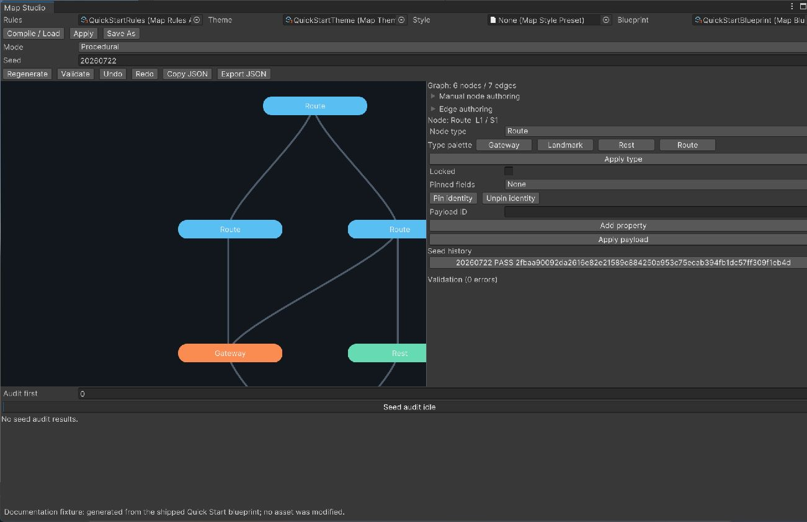
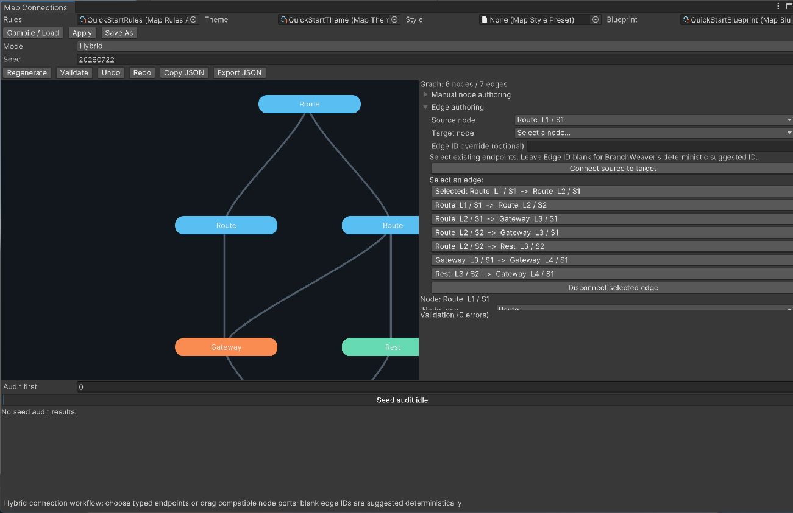

# Author a map by hand

Map Studio can hold the beats you care about in place and let the generator fill in the rest, or
drop generation entirely so you place every node yourself. This page covers the editing half of
**Tools > BranchWeaver > Map Studio**; compiling, regenerating and auditing are covered in
[2. Generate a map in Map Studio](../tutorials/generate-a-map.md).

---

## Choose a mode

The **Mode** field decides what you are allowed to change. Switching mode rebuilds the preview,
and the switch itself is undoable.

| Mode | What you can edit | What the seed does |
| --- | --- | --- |
| **Procedural** | Nothing. The graph comes from the rules and the seed alone. | Chooses the whole map. |
| **Hybrid** | Node type, position, payload, and routes. Every edit re-runs generation around what you pinned. | Chooses everything you have not pinned. |
| **Manual** | The same, plus adding and removing nodes. The graph is exactly what you author. | Forced to `0` and ignored. |

What each switch does to the preview you already have:

- **To Procedural** &mdash; the graph, every pin and every lock are discarded. Press
  **Regenerate** to get a graph back.
- **To Hybrid** &mdash; every node gains an identity pin, so node IDs survive a regenerate, and
  the map is regenerated once to confirm the rules still admit it. If they do not, the switch is
  refused and you stay where you were.
- **To Manual** &mdash; the seed becomes `0` and every node is pinned on all three fields.

## Pin and lock nodes

A pin is an instruction to the generator. A lock is a guard against your own editing. They are
independent, and the node caption shows both: `[P]` for pinned, `[L]` for locked.

Select a node and set **Pinned fields**:

| Pinned | Held across a regenerate |
| --- | --- |
| *nothing* | The node's stable ID stays at that layer and ordinal. |
| **Type** | Its node type. |
| **Position** | Its normalized position. |
| **Payload** | Its payload ID and properties. |

A pin also guarantees its slot exists: pinning a node at ordinal 3 forces that layer to be at
least four nodes wide. An ordinal beyond the layer's authored maximum is refused with
`bw.overrides.node-capacity-conflict`, and a pinned type that a zone forbids is refused too.

**Unpin identity** works in Hybrid mode only, and is refused while a route override still refers
to the node. Editing a node re-pins the field you edited, so unpin last.

!!! warning "A lock is not a generation constraint"
    Locking refuses edits to that node, refuses removing it, and refuses editing any route with a
    locked endpoint &mdash; all with `bw.studio.node-locked`. It is never passed to the generator,
    so **Regenerate** can still replace a locked node. Pin what has to survive generation; lock
    what you do not want to nudge by accident.

## Edit nodes and edges

Nothing in this section is typed from memory. Every node, node type and endpoint you can choose is
already in the window, as a button or a dropdown entry, and each one is named the way you read the
map: its type, then its layer and slot. `Route - L2 / S1` is the Route node in the second layer,
first slot. Hover any of them to see the stable ID underneath.

### Change a node's type

Click a node on the canvas. The right-hand panel names it, and the **Type palette** under **Node
type** shows one button per node type your rules allow.

{ .shot }

1. Click the palette button for the type you want. The **Node type** dropdown follows your click,
   so the two always agree.
2. Press **Apply type**.

The node changes on the canvas and its **Type** pin is set, so a later **Regenerate** keeps it. If
you press **Apply type** with nothing chosen, the status line reads *Select a node type from the
rules palette* and the preview does not move.

The palette holds exactly the types the compiled rules admit, which is why there is no way to type
a type that does not exist. Add a type to the rules and it appears here after the next **Compile /
Load** - see [Create node types](create-node-types.md).

### Move a node and set its payload

Drag a node on the canvas to move it. Releasing writes its new normalized position and pins
**Position**. **Payload ID**, the property rows, and **Apply payload** change the payload and pin
**Payload**. What a payload means to your game is covered in
[Create node types](create-node-types.md).

A refused edit leaves the previous preview exactly as it was, so a node you were not allowed to
move springs back to where it started.

### Add a node in Manual mode

The **Manual node authoring** foldout adds and removes nodes, and its buttons are live in Manual
mode only. It opens already filled in with a legal answer:

| Field | What it arrives as |
| --- | --- |
| **Node ID** | A suggestion for the first free slot, such as `manual.l0.n0`. **Suggest available ID** refills it after you change **Layer** or **Ordinal**, and a number is appended if that ID is taken. |
| **Node type** | The rules' default node type, with the same **Type palette** of buttons beside it. |
| **Layer**, **Ordinal** | The first slot with no node in it, inside the capacity your rules allow for that layer. |
| **Normalized X**, **Y** | 5000 and 5000, the centre of the 0 to 10,000 field. |

So the shortest way to add a node is to open the foldout, click a palette button, and press **Add
node**. Change the layer and ordinal first if you want it somewhere else; the ID follows. **Remove
selected node** deletes the node you have selected, and is refused for a locked one.

!!! note "What a valid ID looks like"
    A stable ID may contain lowercase ASCII letters, digits, `.`, `_` and `-`. The label under
    **Node ID** says *Use lowercase letters, digits, period, underscore, or hyphen* the moment you
    type something else, and **Add node** is refused until it is fixed. You only ever type an ID in
    two places now: this field and the optional edge override below. Everywhere else you pick.

### Connect two nodes

Under **Edge authoring**, both endpoints are dropdowns listing every node in the preview.

{ .shot }

1. Select a node on the canvas. **Source node** is already set to it.
2. Check **Target node**. It is pre-seeded with the first node one layer forward that the source is
   not already connected to, so on a fresh selection it is often the connection you wanted. When
   every candidate is already connected it stays on *Select a node...* and you pick one yourself.
3. Leave **Edge ID override** empty unless you need a particular ID. Blank means BranchWeaver
   derives a stable one from the two endpoints.
4. Press **Connect source to target**.

A route must run forward exactly one layer, and a duplicate connection is refused. Pressing
**Connect** with an endpoint still unset reports *Choose both endpoints from the graph*.

To remove a route, click it on the canvas or in the list of existing edges - each row reads
`Route - L1 / S1  ->  Route - L2 / S2`, and the selected one is prefixed *Selected:* - then press
**Disconnect selected edge**.

In Hybrid mode a connection is recorded as a required route and a disconnection as a forbidden
one, then the map is regenerated around them. If the rules cannot accommodate the change you get
`bw.studio.generation-failed` and the preview does not move.

!!! note "Hand-edited maps can be invalid"
    Nothing forces an edit to satisfy the rules the way generation does, and neither save button
    checks. Press **Validate** and read the diagnostics pane first; clicking a diagnostic
    highlights the nodes it names.

## Save a blueprint

Both save buttons write the current preview &mdash; nodes, routes, pins, locks, mode, seed, search
budgets and fingerprints &mdash; into a **Map Blueprint** asset, along with a reference to the
rules asset it came from.

| Button | Behaviour |
| --- | --- |
| **Apply** | Overwrites the asset in the **Blueprint** field, raises its authoring revision, and registers the change with Unity's undo system. The asset is left dirty, so save the project to put it on disk. |
| **Save As** | Creates a new `.asset` below `Assets` and saves that one asset, leaving anything else dirty in your project untouched. An existing path is refused with `bw.studio.save-path-invalid`; use **Apply** to overwrite. If any step fails, the partly created asset is deleted. |

Both need a graph in the preview. Both refuse to write if the rules asset no longer matches the
snapshot this preview compiled from (`bw.studio.save-rules-mismatch`) or if the blueprint changed
since it was loaded (`bw.studio.save-stale`). Press **Compile / Load** again in either case.

Assigning a blueprint to the **Blueprint** field and pressing **Compile / Load** brings an
authored map back with its mode, pins and locks intact; the blueprint's own rules asset is used,
whatever is in the **Rules** field. In your own code the same asset compiles straight to a graph,
with no generator involved:

```csharp
var compilation = new MapAuthoringCompiler().CompileBlueprint(blueprintAsset);
var graph = compilation.Succeeded ? compilation.Graph : null;
```

## Export JSON

**Copy JSON** puts the current preview on the clipboard. **Export JSON** writes it as UTF-8 to a
file you choose. The dump is canonical and covers the manifest, search budgets, nodes, routes,
node and route overrides, locked node IDs, diagnostics and statistics, and ends with a
`contentFingerprint` taken over everything above it.

Two exports are therefore comparable with a plain text diff. That makes this the quickest way to
see what an edit actually changed, and the right thing to attach to a bug report.

## Next

- **[Write map rules](write-map-rules.md)** &mdash; the constraints your pins and manual nodes
  have to satisfy.
- **[Drive traversal from code](drive-traversal-from-code.md)** &mdash; turn a blueprint into a
  map your game walks.
- **[Determinism, seeds, and fingerprints](../explanation/determinism.md)** &mdash; which changes
  stop an old seed reproducing its map.
