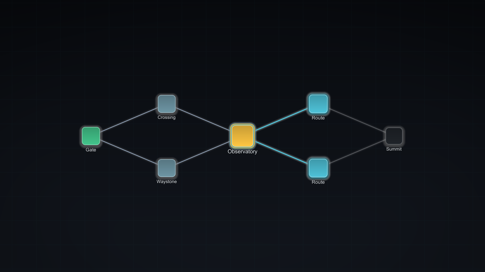
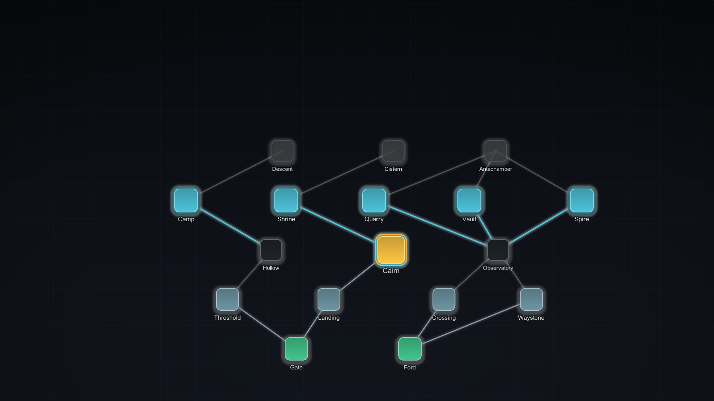

# 3. Authoring maps

Three asset types, created from **Assets > Create > BranchWeaver**:

| Asset | Answers |
| --- | --- |
| **Node Type** | What kinds of place exist, and what each looks like per state |
| **Map Rules** | What shapes of map are allowed |
| **Map Blueprint** | This exact map, authored or captured by hand |

Plus **Map Theme** (layout and zoom) and **Map Style Preset** (appearance, covered in
[guide 4](../tutorials/styling-your-map.md)).

---

## Node types

**Assets > Create > BranchWeaver > Node Type**

A node type is a *kind of place*: Rest, Combat, Gateway, Landmark.

| Field | Notes |
| --- | --- |
| **Stable Id** | Required and unique. A compatibility contract -- see [core concepts](../explanation/architecture.md#stable-ids-are-a-compatibility-contract) |
| **Display Label** | Fallback label when no localization is available |
| **Localization Key** | Optional key passed to your localization adapter |
| **Icon** | Optional sprite, drawn inset inside the node shape |
| **Canvas / World Prefab** | Optional. Supply your own art and BranchWeaver will honour it instead of drawing the node itself |
| **State Colors** | Hidden, Locked, Available, Current, Visited, Completed |
| **Default Payload** | Optional ID plus tagged properties attached to nodes of this type |

### How state colours interact with styles

The node type owns each state's **identity colour**. The style owns how that colour is
*presented*: brightness, opacity, scale, glow, whether a ring is drawn, whether a label
shows.

That split means you can restyle an entire map without editing a single node type, and
you can add a node type without it looking out of place.

### Payloads

`Default Payload` is how you attach game meaning. A Combat node type might carry
`encounter.tier = 2`; your code reads it when the player enters:

```csharp
session.Transitioned += transition =>
{
    var payload = transition.EnteredNode.Payload;
    if (payload.TryGetInt("encounter.tier", out var tier))
        StartFight(tier);
};
```

BranchWeaver never interprets payloads. They are yours.

## Map rules

**Assets > Create > BranchWeaver > Map Rules**

This is the substantial one. Rules are grouped into:

- **Shape** -- layer count range, nodes per layer range, start and end constraints.
- **Node type quotas** -- minimum and maximum occurrences per type, optionally per
  layer band.
- **Connection rules** -- which type may follow which, maximum in-degree and
  out-degree, whether crossing edges are permitted.
- **Zones** -- named layer ranges with their own quotas, for "early game" versus
  "late game" pacing.

Field-by-field detail is in the package's own
`Assets/BranchWeaver/Documentation/Authoring-Field-Reference.md`, which ships with the
product and stays in sync with it.

### Can routes cross each other?

That is your choice, on the rules asset:

| `Crossing Policy` | Meaning |
| --- | --- |
| **`Forbid`** | Routes may **merge** into a node but never intersect mid-air. **The default.** |
| `Allow` | Routes may cross freely, giving denser, more tangled maps. |

`Forbid` is enforced during generation, not cleaned up afterwards: the generator
rejects any candidate edge that would cross an already-selected one, so a map that
comes back is crossing-free by construction rather than by luck. The preflight also
uses it, so an unsatisfiable combination of `Forbid` plus very dense connection rules
is reported before the search starts instead of failing seed by seed.

{ .shot }

/// caption
`Forbid`, the default. Trace any two routes: they merge at a shared node and separate
again, but no line passes over another. Every map image on this site is generated under
`Forbid`, so what you see is what the default gives you.
///

!!! warning "It is part of the fingerprint"
    The crossing policy is included in the rules fingerprint, so changing it changes
    which maps a seed produces. Treat it as a compatibility contract: flipping it after
    shipping means existing seeds no longer reproduce their old maps.

Every screenshot in this documentation uses `Forbid`, which is why routes in the
examples converge but never intersect.

### Start small

A rule set that is too tight is unsatisfiable, and a rule set that is too loose
produces mush. Start with shape only, run a seed audit, then add one constraint at a
time and re-audit.

### When generation fails

You get a **preflight diagnostic** naming the unsatisfiable constraint before any
search happens, or a generation failure with statistics if the search exhausts.

Common causes, in the order they usually bite:

| Symptom | Usual cause |
| --- | --- |
| Preflight rejects immediately | A quota minimum exceeds what the layer bounds can hold |
| Fails on some seeds only | Bounds are satisfiable but tight; widen a range |
| Always fails with connection rules on | A type has no legal predecessor, so it can never be placed |
| Succeeds but looks wrong | Rules are satisfied; the *shape* needs quotas or zones, not more constraints |

Use **Run seed audit** in Map Studio over a hundred seeds. If a handful fail, tighten
nothing and widen one bound. If most fail, the rule set is over-constrained.

## Hand-authored and hybrid maps

Rules-driven generation is not all-or-nothing.

**Map Studio** lets you:

- **Pin** a node so regeneration keeps it where it is.
- **Lock** a node so regeneration will not alter it at all.
- Drag nodes to reposition them.
- Regenerate everything unpinned around what you kept.

This is the hybrid workflow: author the beats you care about, let the generator fill in
the rest, and keep determinism for the generated part.

When you are happy, **Save As** writes a **Map Blueprint** -- a captured, exact map.
Load a blueprint instead of rules when you want a fixed, hand-tuned map (a tutorial
route, a boss approach) with no generation at runtime.

### Export

**Copy JSON** and **Export JSON** produce a readable dump of the current graph. Useful
for diffing two seeds, for external tooling, and for attaching to a bug report.

## Control how much of the map is revealed

Fog is **derived, never stored**, so changing these settings re-reveals an existing save
correctly with no migration.

On the `MapTraversalController`, under **Fog of war**:

| Setting | Effect |
| --- | --- |
| **Reveal Depth** | How many edges ahead of a reached node stay visible as dimmed nodes |
| **Reveal Incoming** | Also reveal backwards, for maps that allow backtracking |
| **Reveal All** | Show the whole map, ignoring depth |

`Reveal Depth` is the one you want. The same map and the same position, three depths
&mdash; the amber node is where the traveller stands:

<div class="grid-2" markdown>

<figure markdown>
  { .shot }
  <figcaption><strong><code>RevealDepth = 1</code></strong> &mdash; the next choices, then dark. The default.</figcaption>
</figure>

<figure markdown>
  { .shot }
  <figcaption><strong><code>RevealDepth = 2</code></strong> &mdash; one more layer, enough to plan a step ahead.</figcaption>
</figure>

<figure markdown>
  { .shot }
  <figcaption><strong><code>RevealAll = true</code></strong> &mdash; the whole route to the summit.</figcaption>
</figure>

</div>

- **0** &mdash; only what the traveller has reached plus what is immediately available.
  Nothing ahead. Maximum mystery.
- **1** &mdash; the next choices show as dimmed nodes. This is the classic run-based-map
  behaviour and the **default**.
- **2 or more** &mdash; look further ahead, one layer at a time.
- At or above the layer count, effectively the whole map.

Notice what happens to the *routes*, not just the nodes: an edge is never more visible
than the node it leads to, so a revealed map shows where a road goes while a fogged one
stops the line at the edge of what is known. You get that for free — there is no separate
edge-fog setting.

!!! note "Dimmed is a hint, not a state"
    A dimmed node is drawn at 75% opacity. It is deliberately close to full brightness:
    the point is "something is there", not "this is different". A hidden node is drawn at
    zero opacity and has hit-testing disabled, so it cannot be clicked by accident.

```csharp
// Wider look-ahead, for a map where planning several steps matters.
controller.FogSettings = new MapFogSettings
{
    RevealDepth = 3,
    RevealIncoming = false,
    RevealAll = false
};

// Or reveal everything, for example after buying a map item.
controller.FogSettings = MapFogSettings.Revealed;
```

Assigning `FogSettings` invalidates the cached runtime state, so the change is visible on
the next presenter refresh.

!!! tip "Per-node overrides"
    For "this one node is revealed by an item", pass explicit unlocked node IDs rather
    than widening the depth for the whole map. Depth is a global rule; unlocked IDs are
    per-node exceptions.

## Validation

**Tools > BranchWeaver > Map Studio > Validate**, or `MapValidator` in code.

Validation is separate from generation on purpose: a hand-edited or migrated map can be
valid or invalid independently of whether a generator produced it. Every diagnostic
names the rule and the node involved, and Map Studio's diagnostics pane navigates to
the offender when you click it.

## Next

- **[Styles and presets](../tutorials/styling-your-map.md)** -- make it look right.
- **[Runtime integration](../how-to/runtime-integration.md)** -- drive it from code.
