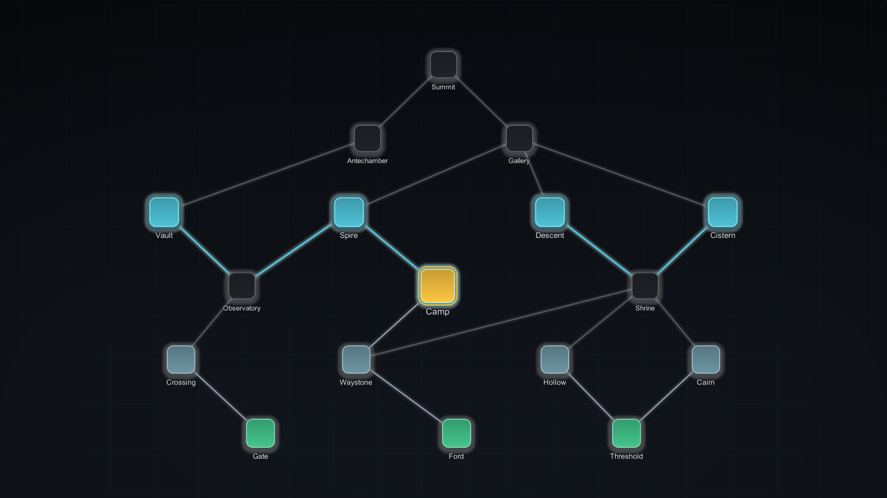
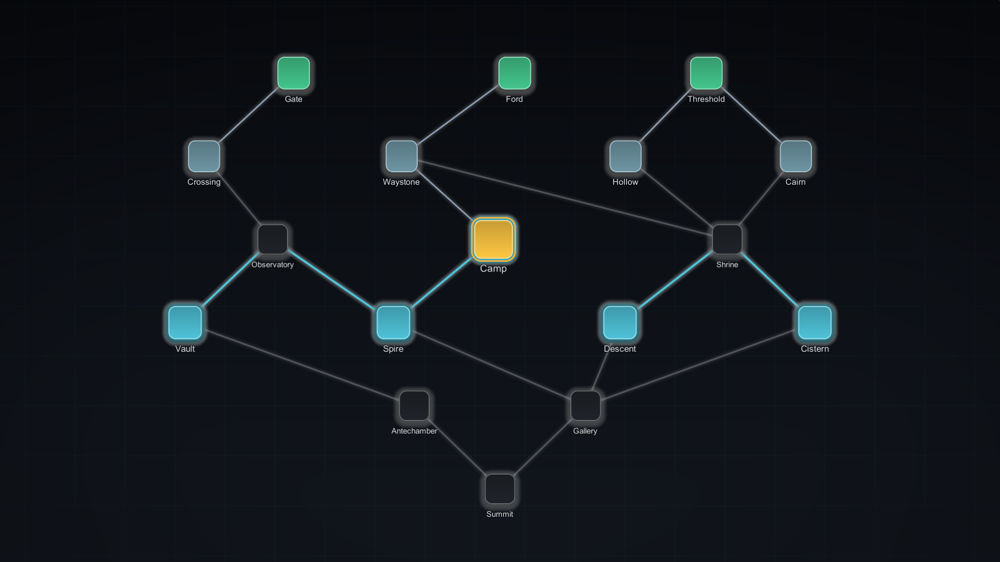
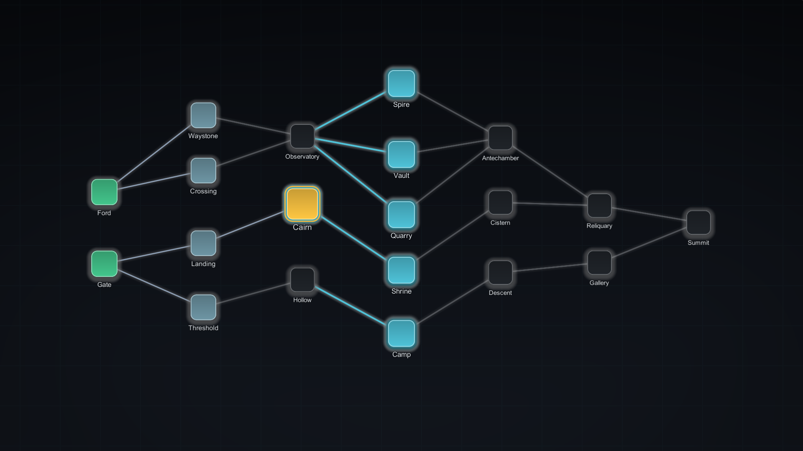
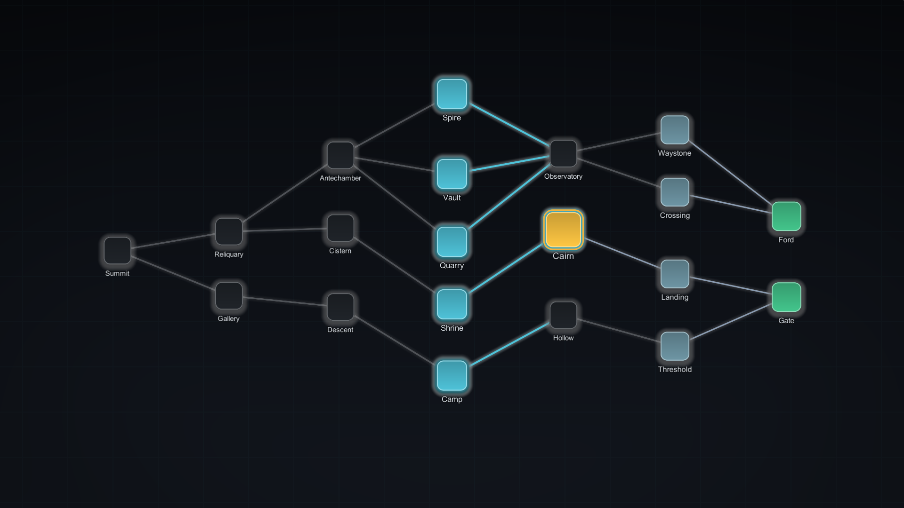

# Place the map on screen

Which way the map runs, how it is scaled into the space it is given, and how much of the
screen it leaves for your own interface are all values on the **Framing** group of a style
asset. All of them are presentation-only: flipping, scaling, or panning a map cannot change
a generated graph, a save envelope, or a fingerprint.

## Flow direction

`FlowDirection` decides which screen direction progress runs in. Same map, same seed, same
style &mdash; only the direction token differs.

<div class="grid-2" markdown>

<figure markdown>
  { .shot }
  <figcaption><code>BottomToTop</code> &mdash; climbing. The default.</figcaption>
</figure>

<figure markdown>
  { .shot }
  <figcaption><code>TopToBottom</code> &mdash; a descent.</figcaption>
</figure>

<figure markdown>
  { .shot }
  <figcaption><code>LeftToRight</code> &mdash; a journey across.</figcaption>
</figure>

<figure markdown>
  { .shot }
  <figcaption><code>RightToLeft</code> &mdash; right-to-left reading order.</figcaption>
</figure>

</div>

The theme decides which *axis* layers advance along; the style decides which way along it.
The flip happens when the presenter converts layout positions for display, which is why it
applies to Canvas and World2D maps alike, and why a run saved climbing and reopened
descending is the same run drawn the other way round. Which setting belongs to which asset
is covered in [Style, theme, and the presenter boundary](../explanation/style-and-theme.md).
A resolved style is immutable, so direction changes by applying another style asset:

```csharp
MapFlowDirection current = presenter.Style.Framing.FlowDirection;  // read
presenter.ApplyStyle(descendingStyle);                             // change
```

## Fit modes

`FitMode` decides how the content is scaled into the area. The fit is applied by
`MapViewportFrame`; without that component the content fills whatever rect it is parented
to, which is why a map laid out for one aspect ratio crops or floats at another. Wiring it
is covered in [Add a map to your scene](../tutorials/add-a-map-to-your-scene.md#add-the-viewport-frame-yourself).

| Fit mode | Result |
| --- | --- |
| `Fit` | Scales until the whole map is visible, aspect preserved. The default, and the mode to use when the map must never be cropped. |
| `Fill` | Scales until both axes are covered. Content past the area runs beyond its edge. |
| `FixedScale` | Uses `FixedScale` (0.05&ndash;8, default 1) and ignores the area size, so the map keeps one on-screen size across resolutions. |
| `Stretch` | Resolves to the same uniform scale as `Fit`. One scale cannot stretch two axes, and distorting node silhouettes was not worth it. |

## Margins, padding, and pan

### Reserve space for your interface

The frame resolves its area in a fixed order: the device safe area is intersected in first
when `RespectSafeArea` is on, then the margins are removed as fractions of what remains,
then the padded content is fitted into that, and finally pan is applied and clamped.

| Token | Units | Default | Effect |
| --- | --- | --- | --- |
| `MarginLeft` / `MarginRight` | Fraction of the area, 0&ndash;0.45 | `0` | Reserves screen space for **your** interface. The map never draws there. |
| `MarginTop` / `MarginBottom` | Fraction of the area, 0&ndash;0.45 | `0.06` | As above, top and bottom. |
| `RespectSafeArea` | Toggle | `true` | Insets into the device safe area before margins are applied. |
| `ContentPadding` | Presentation pixels, 0&ndash;256 | `48` | Breathing room around the map **content**. It is part of the fitted size, so raising it makes the map smaller rather than pushing it past the area. |
| `MapViewportFrame.Pan` | Pixels | `(0, 0)` | An explicit offset of the content inside the area, clamped by the pan limits. |

Margins push the *area* in, padding pushes the *content* in, and pan slides the content
within what is left. Margins are fractions, so one style holds across resolutions.

### Pan and zoom limits

| Token | Default | Effect |
| --- | --- | --- |
| `AllowPan` | `true` | When off, the frame's pan limits collapse to zero and `Pan` cannot move the map. |
| `AllowZoom` | `true` | When off, the frame uses the fitted scale and ignores `Zoom`. |
| `ClampPanToContent` | `true` | Keeps the content reachable. Turn it off and the map can be dragged at least a full area width away from centre. |
| `PanOverscroll` | `0.15` | Fraction of the area that may be over-panned past the content edge. Applies only while `ClampPanToContent` is on. |

Content that already fits leaves no slack to pan, so only the overscroll remains.

```csharp
frame.FrameAll();                       // reset pan and zoom, then refit
frame.FocusOn(nodeId);                  // centre a node, clamped
frame.Pan = new Vector2(-120f, 40f);    // pixels, clamped to the resolved limits
frame.Zoom = 1.5f;                      // multiplies the fitted scale, clamped 0.5-2.5
```

`FocusOn` returns `false` when the node is not in the current layout. Call `FrameAll()`
after generating a new map.

!!! warning "One writer per rect"
    `MapViewportFrame` and `MapInputController` both set the scale and anchored position of
    the rect they are given, and the input controller reasserts its own `Pan` and `Zoom`
    every frame while a map is initialised. `AllowPan = false` bounds the frame; it does not
    stop the player panning. That is covered in [Input, focus, and camera
    framing](input-and-navigation.md), along with the theme's zoom limits.

## Safe areas and phones

The Canvas setup puts a `MapSafeAreaController` on the **BranchWeaver Safe Area** object,
which re-anchors that rect to the device safe area whenever the screen size or the safe
area changes, so a notch never covers the map. `RespectSafeArea` is the frame's own inset,
and matters when the frame sits on a rect larger than the safe area.

The controller also classifies the screen, which is enough to branch a layout without
measuring pixels. `FourByThree`, `SixteenByTen` and `SixteenByNine` match within a small
tolerance, `Ultrawide` is 2.2:1 or wider in landscape, `TallMobile` is 2:1 or taller in
portrait, and the rest is `Other`.

```csharp
if (safeAreaController.Current.AspectClass == MapAspectClass.TallMobile)
    presenter.ApplyStyle(phoneStyle);   // a style with wider margins
```

A World2D map gets no safe-area object, and `MapViewportFrame` needs a `RectTransform`, so
frame a world map by placing and sizing the camera. Pan clamping and focus recovery there
already intersect the camera's pixel rect with the device safe area, so the focused node
stays clear of a notch.

{ .shot }

That is the same map data the Canvas presenter draws, framed by an orthographic camera fitted
to the node bounds rather than by a `RectTransform`. Traversal state reads identically in both
presenters because the state lives in the run, not in the presentation.

### Cropped, off-centre, or unreachable

A map that crops on an aspect ratio you did not design for has no frame. Add
**BranchWeaver > Map Viewport Frame** to the map hierarchy, set `FitMode = Fit` so the whole
map is visible, use the `Margin*` fractions for your own interface, leave `RespectSafeArea`
and `ClampPanToContent` on, and call `frame.FrameAll()` after generating a new map.

## Next

- **[Input, focus, and camera framing](input-and-navigation.md)** &mdash; how focus moves,
  and how to pan, zoom, and reframe from code.
- **[Framing, input and navigation](../reference/framing-input-and-navigation.md)** &mdash;
  every framing type and member, with ranges.
- **[Troubleshooting](troubleshooting.md)** &mdash; match a symptom to its cause.
