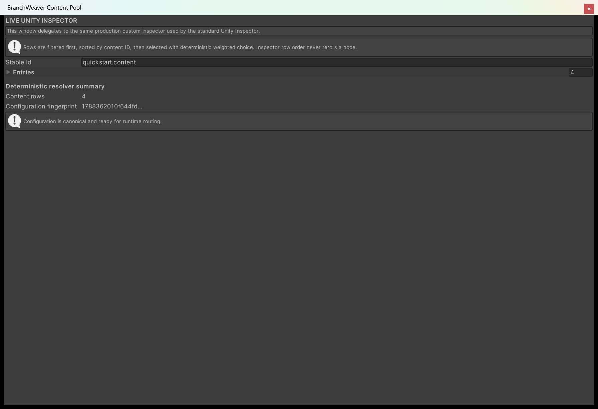
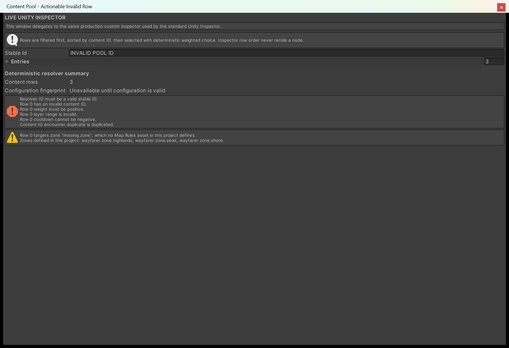

# Route content to nodes

A generated map gives you a shape. A **Map Content Pool** decides what is actually *in* each node:
which encounter, which shop, which event. You author it as rows in the Inspector, the host hands one
content ID to your game when a node is entered, and that choice is written into the save, so
reloading returns the same content instead of rolling again.

After this page you can build a pool, attach it, open its content without writing a resolver, and
say why a row was or was not eligible.

---

## Create the pool

1. **Assets > Create > BranchWeaver > Map Content Pool**.
2. Give it a **Stable Id**. This is the pool's identity and it goes into every save that used it, so
   settle on it before you ship. `campaign.content` is a good shape; `content pool 2` is not a valid
   stable ID at all.
3. Press **+** under **Entries** and fill in one row per piece of content.

<figure markdown>
  { .shot }
  <figcaption>The overview keeps the four rows collapsed so the pool identity and deterministic
  summary remain visible. Expand an entry to edit the row fields described below.</figcaption>
</figure>

Below the rows, **Deterministic resolver summary** counts the eligible rows and shows the
configuration fingerprint. While it reads *Configuration is canonical and ready for runtime routing*,
the pool is valid; a malformed row says so here rather than at the first click in Play Mode.

<figure markdown>
  { .shot }
  <figcaption>This is a deliberately invalid fixture, not the Quick Start pool. The Inspector
  identifies the pool ID and row errors separately, and reports the unknown zone as a warning.</figcaption>
</figure>

## What a row holds

| Field | Meaning |
| --- | --- |
| **Content Id** | The ID *your* game uses to find this content. BranchWeaver hands the text back and never opens anything itself. It must be a stable ID, and it must be unique inside the pool. |
| **Weight** | How often this row is picked next to the other rows that pass the filters. Weight 3 is picked three times as often as weight 1. Minimum 1. |
| **Node Types** | Only nodes of these types may receive this content. Leave the list empty to allow every type. |
| **Minimum Layer**, **Maximum Layer** | The inclusive layer range that may receive it. Leave the maximum at `-1` for no ceiling. |
| **Zone Id** | Only nodes inside this zone may receive it. Leave it empty for every zone, or copy a zone's **Stable Id** out of your rules asset, spelled exactly the same way. |
| **Unique** | Hand this content out at most once per run, however many nodes could have taken it. |
| **Cooldown Selections** | How many other picks must happen before this row can be chosen again. `0` lets it repeat straight away, and **Unique** overrules it. |

!!! note "Layers are counted from zero here"
    **Minimum Layer** `0` is the first row of the map. Map Studio labels that same layer `L1`,
    because a designer reading a map counts from one. A row meant for the first two layers is
    `0` to `1`.

## Attach it and open the content

The **Content Pool** field lives under **Content routing** on `BranchWeaverMapHost`. The Setup
Wizard takes the same asset in its **Content Pool (Optional)** field, so a one-click starter map can
arrive already routed.

{ .shot }

When the player enters a node, the host resolves one row and raises **Content Requested (String)**
with the content ID. Wire that inspector event to whatever opens an encounter in your game and no
code is involved at all.

In C# the same thing arrives as a `MapContentSelection`, which carries the node, the pool, the
content, and its position in the run:

```csharp
private void OnEnable() { map.ContentRequested += OpenContent; }
private void OnDisable() { map.ContentRequested -= OpenContent; }

private void OpenContent(MapContentSelection selection)
{
    // Load your encounter, event, shop, or scene by selection.ContentId.
    // The selection is already committed and will be identical after save and load.
}
```

Call `CompleteCurrent(payload)` when the content is finished. That commits the result and clears the
active selection, and the next node the player picks gets its own.

## The same content comes back after a load

The host writes the run's whole selection history and its active selection into the save alongside
the graph and the progression. Loading restores them and re-raises **Content Requested** for the
node the player was standing on, so a reloaded run continues rather than restarting the encounter.

This is the reason the pool has a **Stable Id**. A load checks the pool's ID, its configuration
fingerprint, and whether every content ID the save names still exists as a row. If any of the three
moved, the load is refused with `bw.host.content-state-invalid` rather than silently rerolling the
player's run into different content. Rename the pool or retune a row, and every save written before
that edit stops loading, on purpose.

While you are building, that is a non-event: set **Save Adapter Kind** to `Memory` and each Play
Mode session starts clean. After you ship, treat the pool ID and its rows the way you treat a
database column name.

## How a row is chosen

The choice is a function of the map and the node, not of a random number generator ticking along
beside them.

1. Every row is filtered against the node: type, layer range, zone, uniqueness, cooldown.
2. The survivors are sorted by content ID.
3. One is chosen by weight, from a roll derived from the pool's ID, the graph's generation key and
   seed, the node's ID, and how many selections have already happened.

Two consequences worth relying on. Dragging rows up and down the Inspector list cannot change what a
node receives, because sorting happens after filtering and before the roll. And the same save
reloaded on another machine routes identically, because nothing in that list is process-local.

!!! warning "An empty result is a refusal, not a blank node"
    Content resolves before traversal commits. If no row is eligible, the request fails with
    `bw.content.exhausted` and the player does not move into the node at all. Keeping one
    unfiltered, non-unique, low-weight row in the pool guarantees there is always an answer. See
    [A node refuses to open its content](troubleshooting.md#a-node-refuses-to-open-its-content).

## Use your own catalog instead

A pool asset is one implementation of `IMapNodeContentResolver`. Write your own when the content
lives in a database, an addressable catalog, or a system you already have. Drop the MonoBehaviour
into the host's **Content Resolver Component** field, which overrides **Content Pool**, or install it
from code with `SetContentResolver`.

```csharp
public sealed class CampaignCatalog : MonoBehaviour, IMapNodeContentResolver
{
    public StableId ResolverId { get { return new StableId("campaign.catalog"); } }
    public string ConfigurationFingerprint { get { return _fingerprint; } }

    public MapContentResolutionResult Resolve(MapContentResolutionRequest request)
    {
        // Read request.Node, request.ZoneId and request.History. Return a selection
        // for request.Node.Id, or MapContentResolutionResult.Failure.
    }
}
```

Two rules make it safe. It must be **pure**: read the immutable request, return a matching
selection, and keep no hidden selection state. And its `ConfigurationFingerprint` must be a lowercase
SHA-256 covering every setting and behaviour revision that can affect the choice - change the
weighting and change the fingerprint, so old saves fail closed instead of quietly rerolling.
Implement `IMapNodeContentSelectionValidator` as well and the host will also confirm on load that
every persisted content ID still exists. `MapContentPoolAsset` does all of this for you.

## Next

- **[Save and load progress](save-and-load.md)** -- the envelope a selection travels inside, and planning a migration.
- **[Drive traversal from code](drive-traversal-from-code.md)** -- the events around entering and completing a node.
- **[Troubleshooting](troubleshooting.md)** -- every `bw.content.*` code and the filter behind it.
- **[Host and content routing reference](../reference/host-and-content-routing.md)** -- the full API surface.
