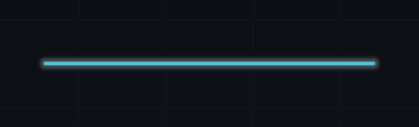
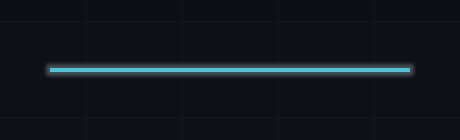
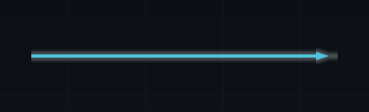
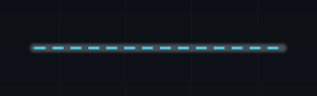
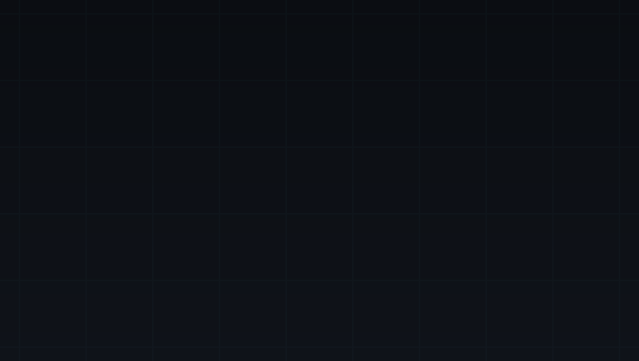

# Style edges and the backdrop

Routes carry most of a map's legibility: the path they take, which of them lead somewhere
the player can reach now, and whether the whole map reads as depth or as a flat rectangle.
Edge geometry belongs to the theme, edge stroke and the backdrop belong to the style.

## Edge geometry

Geometry sits on the **theme**, alongside the orientation and spacing that decide where
nodes go. Open your Map Theme asset and look under **Edges**.

| Field | Range | Default | Effect |
| --- | --- | --- | --- |
| `Edge Geometry` | `Straight`, `Polyline`, `Bezier` | `Bezier` | The path sampled between two nodes. |
| `Bezier Segments` | 2-64 | 16 | Straight pieces per curve. Higher is smoother and draws more quads. |
| `Bezier Control Offset` | 0-10000 | 2500 | How far the control points push along the advancing axis, as a fraction of the whole axis. 2500 is a quarter of it. |

=== "Straight"

    One segment from source to target. The cheapest option, and the geometry an `Arrow`
    cap suits best.

=== "Polyline"

    A right-angled dogleg: out along the advancing axis to the halfway point, across to the
    target's cross-axis position, then in to the target. Three segments. Reads as circuitry.

=== "Bezier"

    A cubic curve that leaves the source parallel to the advancing axis and arrives at the
    target the same way, sampled into `Bezier Segments` straight pieces. The default.

The theme's `Orientation` decides which axis is the advancing one, so the same geometry
values work for a vertical climb and a horizontal journey. Geometry is presentation-only:
changing it cannot alter a graph, a save, or a fingerprint.

!!! note "Segments are quads"
    A Bezier edge at 16 segments draws 16 stroke quads. Points are resampled only when the
    topology changes, but on a dense map the segment count is the first number to lower.

## Stroke, caps, and clearance

Stroke lives on the **style**, in its **Edges** section. `Width` is thickness in presentation
pixels, from 0.5 to 32; the shipped styles run 1.5 in Minimal Mono to 3 in Slate Nocturne.

| | Setting | Effect |
| --- | --- | --- |
| { width="180" } | `Cap = Round` | Each segment is drawn as a capsule, so both its ends are rounded and the joints on a curve disappear. Three of the four shipped styles use it. |
| { width="180" } | `Cap = Butt` | Flat ends. Right for `Straight` geometry and for hairlines; on a curve the joints between segments show. Minimal Mono uses it. |
| { width="180" } | `Cap = Arrow` | An arrowhead on the final segment only, pointing at the destination. Earlier segments keep flat ends, so an arrow reads best on `Straight` geometry. |

`Glow Radius` and `Glow Intensity` put an in-shader halo around the stroke, and the segment
quad is widened to fit it so it is not clipped. The shipped styles set both to half the
node's glow, and a route that leads nowhere reachable draws its glow at 40% intensity, which
stops a glowing style turning the whole map into one bloom.

!!! warning "Two traps"
    `Cap = Arrow` with `Arrow Length` at zero draws no arrowhead at all — the segment falls
    back to flat ends. Set a length when you change the cap; 12 is the value the built-in
    defaults use for an arrow.

    `Node Clearance` is authored, ranged, and clamped, but no shipped view reads it yet, so
    changing it has no visible effect. Space between stroke and node comes from node size
    and the theme's spacing instead.

## Dashes and flow

Dashes and flow do one job: make the route to the player's next legal choice unmistakable.

<figure markdown>
  { width="220" }
  <figcaption><code>Dash Length</code> 16 with <code>Dash Gap</code> 10, as shipped in Neon Circuit.</figcaption>
</figure>

| Setting | Range | Effect |
| --- | --- | --- |
| `Dash Length` | 0-128 | One dash, in presentation pixels. Zero draws a solid line. |
| `Dash Gap` | 0-128 | Space between dashes. |
| `Flow Speed` | -8 to 8 | Dash-and-gap periods scrolled per second. Positive runs toward the destination, negative back toward the source. |
| `Available Width Scale` | 0.25-4 | Width multiplier for a route whose destination is reachable. 1.35 in every shipped style. |

Flow is deliberately narrow. Dashes scroll only when **all** of these hold:

- the route's target node is in the `Available` state,
- `Dash Length` is above zero,
- `Flow Speed` is not zero,
- the style's `Reduce Motion` is off.

Flow with no dash length does nothing, because there is nothing to move; and a route to a
node the player cannot reach never scrolls, because a map of crawling dashes reads as noise.

!!! tip "Colour does the rest"
    The palette carries four edge roles and the style picks one per route in a fixed order:
    locked, leads-to-reachable, already traversed, then default. Width, glow, and flow stack
    on the reachable case, so one change to `Edge Available` drives every kind of emphasis.

The presenter advances flow from `Update` on unscaled time, so dashes keep moving while the
game is paused with `Time.timeScale = 0`. Clear **Advance Style Automatically** and call
`TickStyle(deltaSeconds)` yourself to put the map on your own clock.

## Backdrop, vignette, and grid

{ .shot }

A vertical gradient between the palette's two backdrop colours, a vignette darkening the
corners, and a grid at the style's spacing. All three come from the same shader that draws
nodes and strokes, so the backdrop needs no texture and no post-processing volume.

| Setting | Range | Effect |
| --- | --- | --- |
| `Vignette Strength` | 0-1 | How dark the corners go. Zero disables it. |
| `Vignette Softness` | 0-1 | Where the darkening starts. Higher keeps more of the centre clear. |
| `Grid Spacing` | 0-256 | Distance between grid lines in presentation pixels. Zero hides the grid. |
| `Grid Line Width` | 0-8 | Line thickness. |

The vignette is what stops a large map reading as a flat rectangle: it pulls the eye to the
centre, where the route is. Neon Circuit ships 0.34 and the other three ship 0.22. Take it to
zero for a diagram, up for something closer to a lit table. The grid needs two things rather
than one: `Grid Spacing` above zero **and** a palette `Grid Color` with alpha above zero.

!!! warning "The backdrop needs a view to draw into"
    Backdrop tokens are drawn in the Style Browser and in the preset inspector's live
    preview. At runtime the package draws no backdrop of its own, so the map is transparent
    over whatever is behind it — which is why the sample scenes supply their own scenic
    image. To draw the styled backdrop in a scene, pass a background presenter that
    implements both `IMapBackgroundPresenter` and `IMapStyledView` to `Configure`, and hand
    `MapSurfaceStyling.BuildBackdrop(style)` to a `MapSurfaceGraphic`.

If nodes render as plain rectangles with no shading anywhere, that is the shader failing to
load rather than a setting on this page: see
[Troubleshooting](troubleshooting.md#the-map-looks-flat).

## Optional bloom over the whole map

Everything above is drawn in-shader, including the glow. You do not need a post-processing
stack, and BranchWeaver deliberately depends on none, so nothing here can collide with volumes
or renderer features you already run.

If you want a softer bloom across the whole map anyway, and you are not already running your
own post stack, add **BranchWeaver > Map Camera Bloom (Optional)** to the camera that draws the
map. It is off by default and nothing in the package adds it for you.

```csharp
var bloom = mapCamera.gameObject.AddComponent<MapCameraBloom>();
// Threshold 0.80, Intensity 0.45 and a light vignette by default.
// Set Intensity to 0 to keep the vignette and drop the bloom pass entirely.
```

!!! warning "Built-in render pipeline only"
    Under URP or HDRP the image-effect callback is never called. Rather than silently doing
    nothing, the component detects the active pipeline, logs one warning naming the volume
    overrides to use instead, and disables itself. Reach for your pipeline's own Bloom and
    Vignette overrides there.

Raise **Threshold** if the whole map glows rather than just the bright rims. Raise
**Downsample** to make it cheaper and softer. If the bloom shader cannot load, the effect
copies the frame through unchanged rather than blacking out the map.

## Next

- **[Emphasise node states](style-node-states.md)** &mdash; make the node the player can act on the most prominent thing on screen.
- **[Place the map on screen](place-the-map-on-screen.md)** &mdash; direction, fit, and space reserved for your own interface.
- **[Style, theme, and the presenter boundary](../explanation/style-and-theme.md)** &mdash; deciding whether a setting belongs to the theme or the style.
