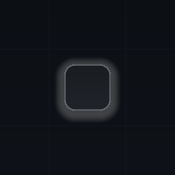
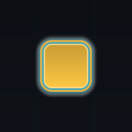
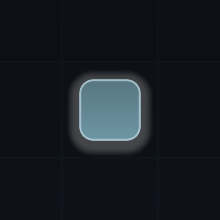
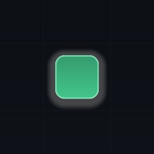

# Emphasise node states

The node the player can act on should be the loudest thing on screen. Six per-state
treatments in a **Map Style Preset** decide that, layered over the colours the node type
owns, so one style restyles every node type at once.

## The six states

They sit in the preset inspector under **Nodes**, one group per visual state: **Hidden
State**, **Locked State**, **Available State**, **Current State**, **Visited State**, and
**Completed State**. The node type supplies each state's identity colour; the state style
decides how that colour is presented.

### What each state controls

| Setting | Range | What it does |
| --- | --- | --- |
| `FillBrightness` | 0&ndash;2 | Multiplies the node type's colour for this state. 1 uses it unchanged. |
| `Opacity` | 0&ndash;1 | Fades the whole node, its icon, and its label together. |
| `Scale` | 0&ndash;2 | Multiplies the authored node size, so a current node can read larger than a locked one. |
| `GlowScale` | 0&ndash;4 | Multiplies the node surface's glow intensity for this state. |
| `ShowRing` | &mdash; | Draws a ring outside the node in the palette's `FocusRing` colour. |
| `RingWidth` | 0&ndash;12 px | Ring thickness. Ignored while `ShowRing` is off. |
| `ShowLabel` | &mdash; | Whether the node's label is present in this state. |

`GlowScale` multiplies rather than sets, so a style whose node surface has no glow cannot
gain one from a state; turn up the node's **Glow Intensity** first, in
[Shape and colour nodes](style-nodes.md). Out-of-range values are clamped when the style is
compiled rather than rejected, so a half-edited preset still renders. Each field is listed
with its type and range under
[`MapNodeStateStyle`](../reference/styling-and-appearance.md#mapnodestatestyle).

### The shipped defaults

Every shipped style uses the same six treatments. Scanning them in order is the check.

| | State | Shipped default |
| --- | --- | --- |
| { width="80" } | **Locked** | Brightness 0.7, opacity 0.72, scale 0.92. Visible, not reachable. |
| { width="80" } | **Available** | Full brightness and opacity, glow &times;0.8. |
| { width="80" } | **Current** | Brightness 1.12, scale 1.16, glow &times;1.6, 3 px ring. |
| { width="80" } | **Visited** | Brightness 0.9, opacity 0.9, scale 0.96. Present but receded. |
| { width="80" } | **Completed** | Full brightness, scale 0.98, no glow. Settled. |

`Hidden` is absent from the list because its opacity is zero. It keeps `ShowLabel` on and
its label object alive at zero alpha rather than destroying it, so revealing a node rebuilds
nothing.

!!! note "Fog composes with state emphasis"
    A node's fog state dims it on top of the per-state opacity instead of replacing it, so
    a dimmed available node still reads as available. What fog covers is in
    [Control what the player can see](reveal-and-fog.md).

## Read the hierarchy, not the colours

Judge the six treatments as a set. The test that matters: with the map in front of you, does
`Available` pull your eye before anything else? If it does not, the palette is fighting the
state styles. The shipped Minimal Mono shows the fix &mdash; its accent is a saturated blue
(`#2D74E0`) while its primary text is near-black (`#17181A`). A flat, glowless style has no
halo to lean on, so emphasis has to come from hue instead.

- Compare states side by side in the **Style Browser**. Under the preview it draws one node
  per state &mdash; `Locked`, `Available`, `Current`, `Visited`, `Completed` &mdash; through
  the shipped mapping, so you compare what ships without entering play mode.
- Change one axis at a time. Brightness, opacity, scale, and glow all read as "louder", and
  raising all four at once leaves nowhere to go for the current node.

!!! warning "Per-state emphasis is a canvas feature"
    `CanvasMapNodeView` applies the state's brightness, opacity, scale, glow, ring, and
    label visibility. The default world-space views keep their own sprite treatment and
    take none of it, so a world-space map needs its own views to honour these settings.

## Labels and typography

`ShowLabel` decides per state whether the label exists at all; with it off, the label
object is deactivated. When it is on, the label's colour follows the state:

| State | Label colour role |
| --- | --- |
| `Locked`, `Hidden` | `TextMuted` |
| `Visited` | `TextSecondary` |
| `Available`, `Current`, `Completed` | `TextPrimary` |

A locked branch therefore recedes without a rule of your own, which is why the three text
roles in the palette are worth setting properly. Everything else about labels is
style-wide, in the **Typography** group:

| Setting | Default | Effect |
| --- | --- | --- |
| `Font` | empty | Left empty, Unity's built-in runtime font is used, so no font ships with the package. |
| `LabelSize` | 14 | Label size in presentation pixels, 6&ndash;48. Used only when the fraction below is zero. |
| `LabelSizeFromNode` | 0.26 | Label size as a fraction of node size, so labels track the node. A 64 px node gives a 17 px label. |
| `LabelOffset` | 6 | How far below the node the label sits, in presentation pixels. |
| `UseOutline` | on | A contrast outline behind the label. With it off, a 1 px drop shadow is used instead. |
| `OutlineColor` | black, 70% | The outline colour. Styles with no glow and dark text get a light outline instead. |

Label size is resolved from the authored node size, not from the state's `Scale`, so a
locked node's label does not shrink with the node. Only its colour and alpha change.

## Motion and reduced motion

The **Motion** group holds the style's own timings. `MotionScale` (0&ndash;2) multiplies every
one of them; `ReduceMotion` forces them to zero and stops decorative motion such as animated
edge dashes.

| Setting | Default | Effect |
| --- | --- | --- |
| `MotionScale` | 1 | Global multiplier. Zero snaps every styled transition. |
| `ReduceMotion` | off | Snaps everything and skips decorative motion. Wire this to a player accessibility setting. |
| `FocusSeconds` | 0.18 | How long a node takes to settle after gaining or losing focus. |
| `Easing` | `EaseOut` | Curve used for the focus settle. |
| `CurrentPulseSeconds` | 1.9 | Seconds per breath of the current node's glow. Zero disables it. |
| `CurrentPulseAmount` | 0.045 | Also gates the pulse: zero disables it. |

Focus is deliberately not an ease-up: a focused node jumps to a slight overshoot of its target
size on the frame focus is requested, then eases back, so selection feels immediate rather than
laggy. Settle and pulse run on the presenter's visual clock, so pausing the game pauses them.

!!! note "The state cross-fade is not a style setting"
    When a node changes state its colour cross-fades over the **theme's**
    `StateTransitionSeconds`, not over a motion token, so `MotionScale` does not shorten it.
    Which setting belongs where is covered in
    [Style, theme, and the presenter boundary](../explanation/style-and-theme.md).

```csharp
[SerializeField] private MapPresenterBase presenter;
[SerializeField] private MapStylePreset standardStyle;
[SerializeField] private MapStylePreset reducedMotionStyle;

// A compiled style is immutable, so swap presets rather than editing motion tokens.
void ApplyMotionPreference(bool reduceMotion)
{
    presenter.ApplyStyle(reduceMotion ? reducedMotionStyle : standardStyle);
}
```

## Next

- **[Shape and colour nodes](style-nodes.md)** &mdash; the silhouette, fill, stroke, and glow the state treatments are layered over.
- **[Create node types](create-node-types.md)** &mdash; give each state its identity colour and a label to show.
- **[Control what the player can see](reveal-and-fog.md)** &mdash; decide which nodes are hidden or dimmed in the first place.
