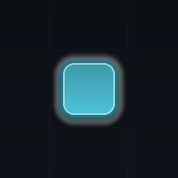
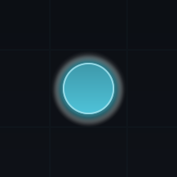

# Shape and colour nodes

A node's silhouette, fill, stroke, glow, and shadow all come from one **Map Style Preset**, and one
change applies to every node type at once. This page names the token that draws each part of a node
and the palette role it reads. Work in a style asset you own, created as in
[Restyle your map](../tutorials/restyle-your-map.md).

## Palette roles

A palette assigns a colour once and reuses it, so one edit moves everything sharing that role.

| Role | What it draws |
| --- | --- |
| `BackgroundTop`, `BackgroundBottom` | The two backdrop gradient stops. |
| `GridColor` | The backdrop grid. Alpha zero hides it. |
| `EdgeDefault`, `EdgeAvailable`, `EdgeTraversed`, `EdgeLocked` | Route colour, chosen by what the route leads to. |
| `FocusRing` | The ring around a node whose state has **Show Ring** enabled. |
| `Accent` | A node's glow. |
| `TextPrimary` | Node labels, and the icon tint when **Tint Icon** is on. |
| `TextSecondary`, `TextMuted` | The label of a visited node, and of a locked or hidden one. |

!!! warning "A node's fill is not a palette role"
    Fill colour comes from the **node type**, which owns a colour per visual state; the style
    multiplies it by that state's **Fill Brightness**. Palette roles cover everything around the node.
    So raising `Accent` changes every node's glow and every available route at once, and still cannot
    change what colour a treasure node is. Fill colours live in
    [Create node types](create-node-types.md).

## Node shape

### The five silhouettes

`Node.Shape` sets the silhouette shared by every node. Each one is the same shader evaluating a
different signed distance field, so all five stay crisp at any zoom and cost one quad.

<figure markdown>
  { .shot }
  <figcaption><code>RoundedRect</code> &mdash; the only shape that reads <code>CornerRadius</code>.</figcaption>
</figure>

<figure markdown>
  { .shot }
  <figcaption><code>Circle</code> &mdash; inscribed in the node box.</figcaption>
</figure>

<figure markdown>
  { .shot }
  <figcaption><code>Hexagon</code> &mdash; inscribed in the node box.</figcaption>
</figure>

<figure markdown>
  { .shot }
  <figcaption><code>Diamond</code> &mdash; inscribed in the node box.</figcaption>
</figure>

<figure markdown>
  { .shot }
  <figcaption><code>Capsule</code> &mdash; always fully rounded on the shorter axis.</figcaption>
</figure>

### Size, corners, and icons

`Node.Size` is the node's edge length in presentation pixels, from 8 to 512; every shipped style uses
64. `CornerRadius` accepts 0 to 64 and is read by `RoundedRect` alone. A node type's icon, when it has
one, sits inside the node inset by `IconInset` — a fraction of node size up to 0.45, so it never
touches the border. The icon stays white unless `TintIcon` is on, which tints it with `TextPrimary`.

!!! note "When your own art replaces the shape"
    If a node type supplies a **Canvas Prefab** that already carries an `Image`, BranchWeaver honours
    it rather than overwriting it, and draws the node type's icon or a rounded sprite instead of the
    shader shape. State colours and transitions still apply; shape, glow, and ring do not. The same
    limit applies to the default world-space views, as noted in
    [Restyle your map](../tutorials/restyle-your-map.md#apply-a-style-from-code).

## Surface: fill, stroke, glow, and shadow

One surface block covers all four, and the node is the surface that uses all of it. The backdrop has
a block of the same type but reads only its fill mode and gradient angle, taking its two colours from
the palette.

### Fill

`FillMode` is `Flat`, `LinearGradient`, or `RadialGradient`. Only the first stop is the node's own
colour; the second is derived from it by `GradientSpread`, between -1 and 1, where positive lightens
and negative darkens. `GradientAngleDegrees` aims a linear gradient, 0 pointing right and 90 up.
Because that second stop is derived, a gradient keeps working when a node type's colour changes.

### Stroke

`StrokeWidth` runs from 0 to 16 presentation pixels, and zero removes the border.

Leaving `StrokeColor` at zero alpha — the default in every shipped style — means *derive the
border from this node's own colour*, lightened. That is what keeps a map of differently coloured
node types coherent without the style naming a border colour per type. Give `StrokeColor` a real
alpha to force one border colour on every node instead; that alpha is multiplied by the node's
opacity, so a faded node keeps a faded border.

### Glow and shadow

`GlowRadius` (0 to 64) and `GlowIntensity` (0 to 4) set the halo, drawn in the accent colour, and
intensity above 1 reads as bloom. The glow is part of the node's shader rather than post-processing,
so BranchWeaver needs no post-processing package and turning glow up cannot conflict with your
volumes or renderer features.

Each state's **Glow Scale** multiplies that intensity, so a node glows only when the surface and the
state both ask for it. In the shipped styles that means available and current nodes glow and the rest
do not — covered in [Emphasise node states](style-node-states.md).

`ShadowRadius` (0 to 32) softens a drop shadow at `ShadowOffset`, in `ShadowColor`, whose alpha
scales the effect and is scaled again by the node's own opacity. Zero radius disables it.

!!! tip "Glow does not change hit-testing"
    Glow, ring, and shadow are drawn into padding added around the node's rect, so they are never
    clipped. That padding is excluded from layout, so a heavily glowing node still occupies exactly
    its rect for clicks and focus.

## Material pooling and batching

Every node, edge segment, ring, and backdrop resolves to one parameter set, and two surfaces with
identical parameters share a material. Identical nodes therefore batch together, which is what keeps
a large map of same-looking nodes cheap. Sizes are quantised to whole pixels in the pool key, and an
animating dash offset to a quarter pixel, so a flowing edge reuses its material frame after frame
instead of allocating a new one.

The pool is a component created on the nearest canvas root, and it counts references: a material is
destroyed when its last user lets go. Because it is a component rather than static state, a map's
materials die with the map instead of surviving a scene unload and then handing out destroyed
materials. Resolved token values are readable at runtime through `presenter.Style`, as shown in
[Restyle your map](../tutorials/restyle-your-map.md#apply-a-style-from-code).

!!! note "If the shader cannot load"
    The surface shader loads from `Resources`, so it survives build shader stripping without you
    editing Always Included Shaders. If it cannot be found, BranchWeaver logs a warning naming the
    path and each surface falls back to its default material, drawing a plain quad rather than
    magenta. See [Troubleshooting](troubleshooting.md#the-map-looks-flat).

## Next

- **[Emphasise node states](style-node-states.md)** &mdash; make the node the player can act on the most prominent thing on screen.
- **[Style edges and the backdrop](style-edges-and-backdrop.md)** &mdash; route geometry, stroke, and what stops a map reading as a flat rectangle.
- **[Create node types](create-node-types.md)** &mdash; the per-state colours a node's fill is built from.
