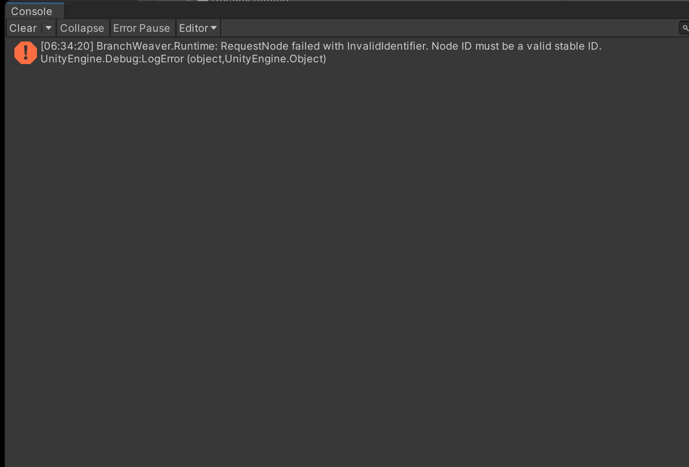
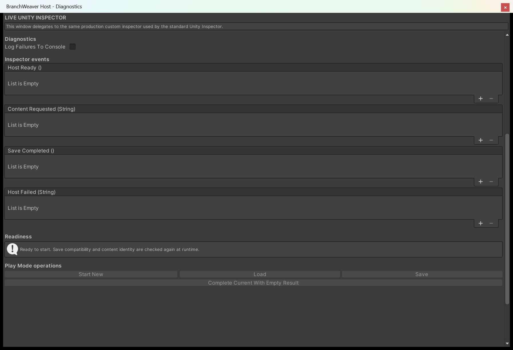
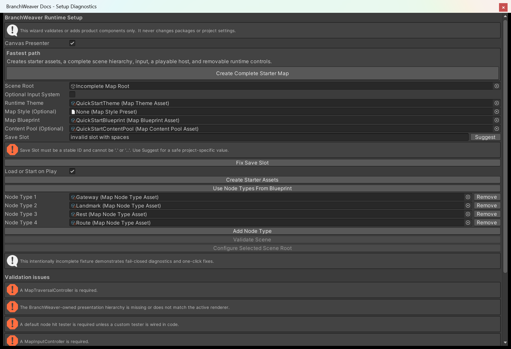

# Troubleshooting

Match a symptom to its cause, apply the fix, then file a report that reproduces the problem from a
seed. Entries are ordered by how often each one actually happens.

## Read the console first

`BranchWeaverMapHost` writes one `Debug.LogError` for every operation it refuses, naming the
operation and the failure kind before the message:

```text
BranchWeaver.Runtime: TryLoad failed with SaveIdentityIncompatible. The save does not match the
assigned blueprint or saved graph fingerprint.
```

Clicking that line in the Console selects the host that produced it. The first word is one of five
operations - `StartNew`, `TryLoad`, `Save`, `RequestNode`, `CompleteCurrent` - so it already tells
you which part of the run gave up.

<figure markdown>
  { .shot }
  <figcaption>A staged invalid node request produces one error naming the operation,
  <code>RequestNode</code>, and the reason it was refused. It is an error-path example, not a
  successful sample run.</figcaption>
</figure>

The toggle behind it is **Log Failures To Console**, in the host's **Diagnostics** group, and it is
on by default. Leave it on while you build. Turn it off only once your game shows a failure of its
own, through the **Host Failed (String)** inspector event or the `HostFailed` C# event; the message
is the same text either way.

If a map is missing and the Console is empty, check that toggle before anything else on this page.
An unticked box is the one state in which BranchWeaver fails silently.

<figure markdown>
  { .shot }
  <figcaption>The staged host with console logging turned off. During integration, leave the box
  ticked unless your own <strong>Host Failed</strong> listener presents or records the same
  message.</figcaption>
</figure>

## The map does not start in Play Mode

**Symptom.** Play Mode runs, the scene and the panel are there, and no nodes are drawn.

**Cause.** The host refused to start the run and stopped. With **Auto Start** ticked it tries the
save slot first, and creates a fresh run *only* when the adapter reports `NotFound`. Every other
outcome is refused and left alone: a corrupt, unsupported, migration-failed, or identity-mismatched
save is never quietly replaced by a new map. That is the fail-closed load path, and a player's run
being regenerated behind their back is the failure it exists to prevent.

**Fix.** Read the one Console error and match its failure kind here.

| Failure kind | Code | What to change |
| --- | --- | --- |
| `NotConfigured` | `bw.host.configuration-missing` | A required field is empty: **Blueprint**, **Theme**, **Traversal Controller**, or the adapter component. |
| `InvalidIdentifier` | `bw.host.identifier-invalid` | **Save Slot** is not a stable ID. |
| `AuthoringInvalid` | `bw.host.authoring-invalid` | The blueprint, rules, node types, or theme did not compile. The diagnostic names the asset. |
| `GenerationFailed` | `bw.host.generation-failed` | The rules admit no map for this seed. See [Generation fails](#generation-fails). |
| `ControllerRejected` | `bw.host.controller-rejected` | The controller refused the graph, usually a node type the saved graph names that no longer resolves. |
| `SaveFailed` | `bw.host.save-failed` | Storage refused the read. `SaveFailureKind` separates corruption from I/O. |
| `SaveIdentityIncompatible` | `bw.host.save-identity-invalid` | The save no longer belongs to what this scene is configured with. See below. |
| `ContentStateIncompatible` | `bw.host.content-state-invalid` | The routed content inside the save no longer matches the configured pool. See below. |

For the first three, **Tools > BranchWeaver > Setup Wizard** finds the same problems without entering
Play Mode. **Validate Scene** compiles the blueprint's preview seed, discovers every referenced node
type, and lists what is wrong; several rows carry a one-click fix.

{ .shot }

### The save-identity family

`bw.host.save-identity-invalid` means the bytes are fine and the identity is not. The host
re-fingerprints the blueprint on every load and compares it against what the save recorded.

| Console message | What changed |
| --- | --- |
| The saved graph was not created by the assigned blueprint. | The **Blueprint** field points at a different asset, or that asset's rules, mode, or overrides moved since the save. |
| The save does not match the assigned blueprint or saved graph fingerprint. | The same asset, edited contents. Any hashed rule field does this. |
| The save contains an unsupported or incomplete host metadata schema. | Host metadata is missing a key, or carries one this version does not know. |
| The save predates the runtime host identity schema and cannot be restored safely. | The file was written by a build older than content routing. |

Its sibling `bw.host.content-state-invalid` covers the routing half, most often *The content resolver
identity or configuration changed since this run was saved*: the pool's **Stable Id** was renamed, or
a row was added, removed, or retuned. Both refusals are the same decision, taken about a different
identity.

While you are building, the fix is to throw the save away: set **Save Adapter Kind** to `Memory` so
the slot dies with Play Mode, or delete the file the `File` adapter wrote under
`<persistentDataPath>/<Save Folder>/`. Once a build has shipped, none of these is a bug to work
around - it is a migration decision. Keep the blueprint recipe and the pool identity stable, and plan
the change with [Save and load progress](save-and-load.md) and
[Route content to nodes](route-content-to-nodes.md).

## A node refuses to open its content

**Symptom.** A node is drawn as available, the click is accepted, and nothing happens. No content
opens, the traveller does not move, and the node stays available.

**Cause.** Content resolves *before* traversal commits, so a pool that cannot answer refuses the
whole request rather than moving the player into a node with nothing in it. The Console line is:

```text
BranchWeaver.Runtime: RequestNode failed with ContentResolutionFailed. No content row is eligible
for this node after filters, uniqueness, and cooldowns.
```

That diagnostic is `bw.content.exhausted`, and its context is the node ID.

**Fix.** A row is offered to a node only when it passes every filter at once. Work down them in this
order; the first one that excludes every row is your answer.

| Filter | The row passes when | What usually goes wrong |
| --- | --- | --- |
| **Node Types** | The list is empty, or it contains that node's own type asset. | Only Rest and Gateway rows exist, and the player clicked a Route node. |
| **Minimum Layer** / **Maximum Layer** | The node's layer is inside the inclusive range. `-1` as the maximum means no ceiling. | A maximum of `3` on every row in a five-layer map. The pool counts the first layer as `0`, while Map Studio labels it `L1`. |
| **Zone Id** | It is empty, or it matches the zone that contains the node's layer. | Typing the zone's name instead of copying its **Stable Id** out of the rules asset. |
| **Unique** | This content has not been handed out yet in this run. | Every row ticked **Unique**, in a run with more nodes than the pool has rows. |
| **Cooldown Selections** | At least that many other picks have happened since this content was last chosen. | A two-row pool with a cooldown of `2` on both rows: after the second pick neither row is legal. |

Row order in the Inspector is deliberately not one of them, so dragging rows around never fixes an
exhausted pool. The cheapest repair is one unfiltered row with no **Unique**, no cooldown, and a low
weight, which can always answer.

A malformed pool fails differently: it refuses *every* node, on the first click, before any filter is
applied.

| Code | Cause |
| --- | --- |
| `bw.content.resolver-invalid` | The pool's **Stable Id** is empty or not a valid stable ID. |
| `bw.content.entry-invalid` | A row has a bad content ID, a weight below 1, a negative minimum layer, a maximum below the minimum, a negative cooldown, a malformed zone ID, or a node-type filter pointing at a missing asset. |
| `bw.content.entry-duplicate` | Two rows share one content ID. |
| `bw.content.request-invalid` | Only reachable from a custom resolver: the node handed to it does not belong to the graph. |

The pool's own inspector reports all four before you press Play, under **Deterministic resolver
summary**. [Route content to nodes](route-content-to-nodes.md) walks through the fields.

## The map looks flat

**Symptom.** Nodes draw as plain quads with no gradient, stroke, glow, or ring.

**Cause.** The map surface shader could not be loaded, so every surface fell back to its default
material. One console warning names the resource path it tried.

**Fix.** Reimport `Assets/BranchWeaver/Runtime/Runtime/Resources`. The shader lives in a `Resources`
folder on purpose: that keeps it out of build shader stripping without you editing
**Always Included Shaders**.

The fallback is deliberate: a missing shader degrades to flat colour rather than magenta.
[Shape and colour nodes](style-nodes.md) lists what each token would otherwise draw.

## Generation fails

Every failure carries a kind and a diagnostic, and Map Studio prints the kind beside each seed in a
seed audit.

| Failure kind | What it means | What to change |
| --- | --- | --- |
| `InvalidInput` | Preflight rejected the request before any search ran, usually a quota minimum larger than the layer bounds can hold. | Widen the bound or lower the quota. The diagnostic names the constraint. |
| `Unsatisfiable` | No graph satisfies the hard constraints. This is proven, not guessed. | Remove a constraint. A node type with no legal predecessor can never be placed. |
| `SearchBudgetExhausted` | The search ran out of budget without proving anything either way. | Loosen the tightest rule, or raise `MaximumTopologyTrials` and `MaximumTypeTrials`. |
| `PostValidationFailed` | Complete candidates were found and every one failed post-generation validation. | Relax the post-validation rule rather than the shape rules. |

If generation succeeds but the shape is wrong, the rules are being satisfied and you need quotas or
zones to shape pacing, not more constraints. See [Write map rules](write-map-rules.md).

## The map is cropped or off-centre

Add **BranchWeaver > Map Viewport Frame** to the map hierarchy. Without it the map fills whatever rect
it is parented to, so an aspect ratio you did not design for crops it or leaves it floating. The frame
reads its values from the assigned style's **Framing** group, not from fields on the component:

- `FitMode = Fit` keeps the whole map visible.
- `MarginLeft`, `MarginRight`, `MarginTop` and `MarginBottom` are fractions of the area, so one style
  reserves interface space at every resolution.
- `RespectSafeArea` insets the map clear of notches and home indicators.
- `ClampPanToContent` stops the player dragging the map fully off screen.

Call `frame.FrameAll()` after generating a new map. Full detail in
[Place the map on screen](place-the-map-on-screen.md).

## Nodes overlap or the map is too dense

Spacing is a layout decision, so `LayerSpacing` and `NodeSpacing` live on the **Map Theme**, not on
the style. Raise both. Node *size* is a presentation decision, so `Node.Size` lives on the style and
each state's `Scale` multiplies it; changing size never moves a node. See
[Style, theme, and the presenter boundary](../explanation/style-and-theme.md).

## Clicking a node does nothing

Check in this order.

1. **Is the node available?** `controller.State.IsAvailable(nodeId)`. A dimmed node is dimmed because
   the session says it is locked.
2. **Is it hidden by fog?** A view in `MapFogState.Hidden` has its raycast target turned off by
   design. See [Control what the player can see](reveal-and-fog.md).
3. **Is the input plumbing there?** A uGUI map needs a `GraphicRaycaster` on the canvas and an
   `EventSystem` in the scene &mdash; see [Input, focus, and camera framing](input-and-navigation.md).
4. **Are you asking the presenter?** It never decides legality. Ask the controller, as in
   [Drive traversal from code](drive-traversal-from-code.md).
5. **Was the click accepted and then refused?** If a Console error names `RequestNode`, the map
   heard you and the content pool did not answer. See
   [A node refuses to open its content](#a-node-refuses-to-open-its-content).

## A save will not load

Every save call returns a result carrying a `MapSaveFailureKind`. Log it rather than guessing.

| Failure kind | Cause |
| --- | --- |
| `MigrationMissing` | The envelope's schema version has no registered migration towards the current one. |
| `MigrationFailed` | A migration threw, or produced an envelope that no longer validates. |
| `UnsafePath` | `FileMapSaveAdapter` refused a slot ID that would resolve outside its root. It fails closed on purpose. |
| `InvalidEnvelope`, `CorruptData` | The bytes did not parse, or parsed into something invalid. |
| `NotFound`, `IoFailure` | No primary, temporary, or backup file exists for the slot; or the file system refused the operation. |

A save also stops resolving when a **stable ID** it references changes. Renaming a node type or rules
*asset* is safe; changing its *ID* is not, because the save stores the ID. Treat IDs as a
compatibility contract ([Core concepts](../explanation/architecture.md)) and plan the change with
[Save and load progress](save-and-load.md).

## The same seed gives different maps

The map is a function of rules and seed together, so both have to hold still.

- **A non-deterministic seed**, taken from `UnityEngine.Random`, `DateTime.Now`, or a frame count.
  `BranchWeaver.Core` compiles with no engine references, so it cannot see Unity's RNG at all: the
  non-determinism is always on your side of the boundary.
- **The rules changed.** A blueprint stores a `RulesFingerprint`, and recompiling it after a rules
  edit raises a metadata mismatch error naming which fingerprint moved.
- **The generator version changed.** That is a deliberate compatibility boundary, not a bug.

[Determinism, seeds, and fingerprints](../explanation/determinism.md) covers which edits break a seed.

## Map Studio edits vanished

Map Studio previews without modifying your project. Edits live in the window until you press
**Apply**, which writes back to the source asset, or **Save As**, which writes a new blueprint. The
window's **Undo** and **Redo** move through preview history. This is the intended safety behaviour.
See [Author a map by hand](author-by-hand.md).

## The development overlay

`MapDevelopmentOverlay` draws a draggable window with reveal, unlock, teleport, complete current,
reset, force result, regenerate, and copy manifest commands, so you can reach a late-run state without
playing to it. Add it to a scene object and assign an initialised controller.

It only exists when `BRANCHWEAVER_DEVTOOLS` is a scripting define symbol: the `BranchWeaver.DevTools`
assembly carries that define as a constraint, and `MapTraversalController` implements
`IMapDevelopmentHost` under the same define, so a production build has no development surface to
find. Every command returns a result, and the window shows the message when one is refused.

| Message in the window | Cause |
| --- | --- |
| No development host assigned. | No controller in the field and no `Host` set from code. |
| The map is not initialized. | `Initialize` has not run on the controller yet. |
| Enter a valid node ID. / The node ID is not present in the graph. | The typed text is not a stable ID in this graph. |
| No regeneration handler is registered. | Nothing is subscribed to `DevelopmentRegenerateRequested`. The overlay asks; your code regenerates. |
| The regeneration handler did not synchronously initialize a valid replacement map. | The handler deferred the work. It has to initialise the controller before returning. |

!!! warning "Do not ship the define"
    **Teleport** writes a progression state directly rather than walking a legal transition, and
    **Reveal all** and **Unlock** override what the fog rules would show. Add
    `BRANCHWEAVER_DEVTOOLS` to development configurations only, and check that a release build
    compiles without the assembly.

## Getting help

Include all of the following. Because generation is deterministic, a seed plus the rules that
produced it usually reproduces the problem exactly.

- Unity version and render pipeline.
- The **seed** and the **rules asset**, or the file from Map Studio's **Export JSON**.
- The full console output, including any BranchWeaver warning and every
  `BranchWeaver.Runtime:` error line. Each one carries the operation and the failure kind.
- The generation manifest, if the overlay is available. **Copy generation manifest** puts the
  generator version, graph format version, seed, rules fingerprint, graph fingerprint, and generation
  key on the clipboard as one line.

## Next

- **[Determinism, seeds, and fingerprints](../explanation/determinism.md)** &mdash; why an old seed stops reproducing its map.
- **[Save and load progress](save-and-load.md)** &mdash; adapters, failure kinds, and planning a migration.
- **[Route content to nodes](route-content-to-nodes.md)** &mdash; the pool fields behind every `bw.content.*` code.
- **[Generate a map in Map Studio](../tutorials/generate-a-map.md)** &mdash; running a seed audit before you change rules.
