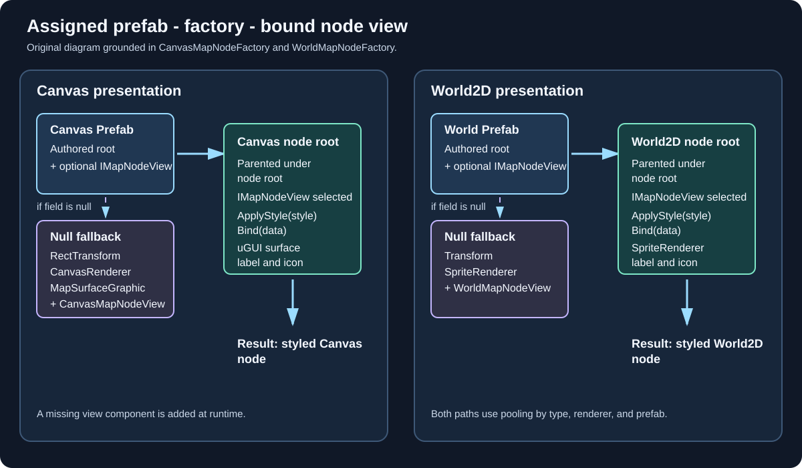

# Use your own node art

A node type can draw itself with your prefab instead of the shape BranchWeaver builds. This page
covers the two prefab fields on a node type, what the built-in factories do with them, and the code
you write before a prefab reacts to state, fog, and transitions. You need a Node Type asset, a
prefab, and one C# script.

{ .diagram }

This is an original implementation diagram, not a screenshot. The built-in factories instantiate
the assigned prefab under the presenter's node root. A prefab without an `IMapNodeView` receives
the matching built-in view component; a null field uses the factory's fallback root and components.
The resulting view is then bound to the node state and presented by Canvas or World2D.

## Assign a prefab to a node type

Both fields sit under **Presentation** on a Node Type asset, beside **Icon**. `CanvasMapPresenter`
reads **Canvas Prefab**, `WorldMapPresenter` reads **World Prefab**, and neither falls back to the
other: a Canvas map with only a **World Prefab** assigned still draws the built-in node.

| Field | What the factory does |
| --- | --- |
| Null, Canvas | Builds a `GameObject` named `BranchWeaver Canvas Node` carrying a `RectTransform`, a `CanvasRenderer`, a `MapSurfaceGraphic` (an `Image` subclass), and a `CanvasMapNodeView`. |
| Null, World2D | Builds a `GameObject` named `BranchWeaver World Node` carrying a `SpriteRenderer` and a `WorldMapNodeView`. |
| Set | Calls `Object.Instantiate(prefab)`, parents the instance under the presenter's node root, then asks it for a component implementing `IMapNodeView`. |

When the supplied prefab carries no `IMapNodeView`, **nothing is rejected at runtime**: the factory
calls `AddComponent<CanvasMapNodeView>()` - or `AddComponent<WorldMapNodeView>()` - and drives your
prefab through the built-in view, the fallback both property doc comments describe. Views pool by
`type id | renderer key | prefab instance id`, so changing any of the three releases the live view.

!!! warning "The Setup Wizard is stricter than the runtime"
    `MapSetupValidator` reports a node prefab with no `IMapNodeView` component as an **error**, and
    warns when a material on it uses a Universal or HDRP shader, since that prefab then renders
    under that pipeline only.

### What the built-in view does with it

`CanvasMapNodeView` looks for an `Image` on its own GameObject; `MapSurfaceGraphic` derives from
`Image`, so one counts as both.

- **No `Image` at all** - it adds a `MapSurfaceGraphic` and draws the fully styled node: shape,
  stroke, glow, shadow, ring, and the type's icon inset as a child. Art on child objects survives.
- **A `MapSurfaceGraphic`** - the same path, using the one you supplied.
- **A plain `Image`** - honoured rather than replaced, but its `sprite` is overwritten on every bind
  with the node type's **Icon**, or a generated rounded sprite when there is none. Its `color` and its
  `raycastTarget` are driven after that, and nothing else.

Either way the view overwrites the root `RectTransform`'s anchors, `anchoredPosition`, `sizeDelta`, and
`localScale`, and adds a `Node Label` child once the node type has a label the state's treatment shows.
`Bind` casts the root transform to `RectTransform`, so author a Canvas prefab as a UI object &mdash;
`CanvasMapNodeView` carries `[RequireComponent(typeof(RectTransform))]` for the same reason.
`WorldMapNodeView` is blunter still, overwriting the root `SpriteRenderer`'s `sprite`, `sortingOrder`,
`color`, and `enabled`, and the transform's position and scale.

## Write your own `IMapNodeView`

Implement the interface and the presenter touches nothing but the members it needs: `NodeId`,
`Transform`, `Bind`, and `SetActive`. Everything else is opt-in, `IMapFocusView` included.

| Interface | What you gain |
| --- | --- |
| `IMapNodeHitState` | You decide whether the node is clickable, instead of the hit tester guessing from the rect or the renderers. |
| `IMapNodeTransitionView` | Per-view state animation. Six members, all required: `IsTransitioning`, `PrepareForBind`, `BeginTransition`, `RestoreAfterUnchangedBind`, `AdvanceTransition`, `CancelTransition`. The shipped presenter never calls `RestoreAfterUnchangedBind`, but the interface still demands it. |
| `IMapStyledView` | `ApplyStyle(CompiledMapStyle)` and `TickStyle(float)`, so the style reaches your art at all. |

`Bind` is not a per-frame call: it runs on a node's state change and for every node on a topology
change, so it must be idempotent, and it runs inside the traversal controller's dispatch, so never
request a selection or a completion from it.

```csharp
using BranchWeaver.Authoring;
using BranchWeaver.Core;
using BranchWeaver.Runtime;
using UnityEngine;

[RequireComponent(typeof(SpriteRenderer))]
public sealed class BannerNodeView : MonoBehaviour, IMapNodeView, IMapNodeHitState, IMapStyledView
{
    [SerializeField] private SpriteRenderer art;
    private CompiledMapStyle _style;
    public StableId NodeId { get; private set; }
    public Transform Transform { get { return transform; } }
    public bool IsHitTestVisible { get; private set; }
    public void ApplyStyle(CompiledMapStyle style) { _style = style; }
    public void TickStyle(float presentationDeltaSeconds) { }
    public void SetActive(bool active) { gameObject.SetActive(active); }

    public void Bind(MapNodeViewData data)
    {
        NodeId = data.Node.Id;
        IsHitTestVisible = data.FogState != MapFogState.Hidden;
        var point = data.PresentationPosition * 0.01f;   // the presenter always supplies one
        transform.localPosition = new Vector3(point.x, point.y, 0f);
        var state = MapStyleRuntime.StateStyle(_style, data.VisualState);
        var size = data.NodeSize * 0.01f * state.Scale;
        transform.localScale = new Vector3(size, size, 1f);
        var identity = StateColor(data.NodeType, data.VisualState);
        var tint = identity * state.FillBrightness;
        tint.a = identity.a * state.Opacity * MapStyleRuntime.FogOpacity(data.FogState);
        art.color = tint;
    }

    private static Color StateColor(CompiledMapNodeType type, MapNodeVisualState state)
    {
        if (state == MapNodeVisualState.Locked) return type.LockedColor;
        if (state == MapNodeVisualState.Available) return type.AvailableColor;
        if (state == MapNodeVisualState.Current) return type.CurrentColor;
        if (state == MapNodeVisualState.Visited) return type.VisitedColor;
        if (state == MapNodeVisualState.Completed) return type.CompletedColor;
        return type.HiddenColor;   // also the fallback for a state a view cannot recognise
    }
}
```

`MapStyleRuntime` is public but hidden from IntelliSense. `CanvasMapNodeView` calls `StateStyle` the
same way; it never calls `FogOpacity` itself, reaching it through `MapStyleRuntime.ResolveNodeColors`,
which is what folds fog into the styled surface. Two jobs the package leaves to you: without
`IMapNodeTransitionView` a node snaps to its new colour and the theme's **State Transition Seconds**
goes unused, and hiding a fogged
node is yours too, since the presenter activates a node view after every bind, fog or no fog.

## Choose Canvas or World2D for custom art

| | Canvas | World2D |
| --- | --- | --- |
| Node root | `RectTransform`, sized in presentation pixels | `Transform`, scaled by `NodeSize * 0.01` |
| Labels | uGUI `Text` with the style's font, size, colour, and outline | `TextMesh` plus a shadow, always white |
| Style in the built-in view | `IMapStyledView` implemented | `IMapStyledView` implemented |

Pick Canvas when the map is interface and you want uGUI typography. Pick World2D when the map must
sit in the scene with other 2D content; its built-in view also implements `IMapStyledView`, while
custom behaviour still belongs in your own view.

### Experience Studio World2D generated shapes

This section describes the Experience Studio `World2DExperienceRenderer`, not the legacy
`WorldMapPresenter` and `WorldMapNodeView` flow above. In an Experience preset, choose **Shape** in
the style to set a generated node body to a rounded rectangle, circle, hexagon, diamond, or capsule.
**Corner Radius** is used for rounded rectangles. With no compiled style, the generated fallback is a rounded
rectangle. Changing the shape is presentation-only and preserves node IDs, edges, and saves.

Use the preset's **Asset Mappings** to replace node art by type. Generated nodes can display a type
icon over their shaped body. Authored prefabs use the Experience renderer's mapping contract;
`WorldMapNodeView.Bind` belongs to the separate legacy presenter flow described above.

### Experience Studio World3D route width

This section describes the Experience Studio `World3DExperienceRenderer`. It converts the style's
**Edge Width** from presentation pixels into world units using `MapScale` and the compiled map
layout extent. An available route is multiplied by **Available Width Scale**; default and locked
routes use the base width. The resulting value is assigned to the route `LineRenderer` before its
endpoints are clipped to the node bounds.

Changing Edge Width changes only stroke thickness and endpoint clipping. It does not alter route
snapshot points, curve sampling, graph identity, or saves. The same edge style can therefore be
shared by a custom World3D node prefab without editing the prefab's source materials.

## What the compiled style reaches, and what it does not

The presenter casts each view to `IMapStyledView` and skips the ones that are not. It calls `ApplyStyle`
once right after the factory creates a view, before the first `Bind`, and again on every live view when
you restyle the presenter, so an implementation must restyle in place. `TickStyle` runs once a frame per
view on unscaled time while **Advance Style Automatically** is on.

| Your prefab | What the style reaches |
| --- | --- |
| `CanvasMapNodeView`, no root `Image` | Everything: shape, fill, stroke, glow, shadow, ring, per-state scale, brightness and opacity, icon inset and tint, label typography, motion. |
| `CanvasMapNodeView`, plain root `Image` | Per-state **Scale**, label font, size, colour, offset and outline, focus easing, colour transitions. **Not** shape, corner radius, fill mode, stroke, glow, shadow, ring, icon inset, icon tint, **Fill Brightness**, or **Opacity**, all of which are computed into a surface request a plain `Image` never receives. |
| `WorldMapNodeView` | `ApplyStyle` updates the `WorldMapSurface` and current-node pulse; `Bind` applies state colour and fog to the root `SpriteRenderer`; focus scales the root by 1.15. The node type icon remains on that renderer; labels use `TextMesh` plus a shadow. |
| Your own `IMapNodeView` | Nothing, unless you implement `IMapStyledView` and read the tokens yourself. |

A style is numbers handed to whoever reads them, not a post-process over your art: no change to a Map
Style Preset repaints a prefab that ignores it. The tokens are in [Shape and colour nodes](style-nodes.md).

## Custom art without writing code

For a distinct look per type with no scripting, stay on the built-in Canvas view and use the fields the
node type already has. **Icon** is drawn inset inside the node shape by the style's `IconInset`, tinted
with `TextPrimary` when **Tint Icon** is on; the six **State Colors** are that type's identity in each
state, multiplied by the style's **Fill Brightness** and faded by fog.

## Next

- **[Create node types](create-node-types.md)** &mdash; the asset both prefab fields live on.
- **[Shape and colour nodes](style-nodes.md)** &mdash; the tokens a custom view can read.
- **[`IMapNodeView`](../reference/presentation-and-views.md#imapnodeview)**, **[`IMapNodeViewFactory`](../reference/presentation-and-views.md#imapnodeviewfactory)**, **[`CanvasMapNodeView`](../reference/presentation-and-views.md#canvasmapnodeview)**, **[`WorldMapNodeView`](../reference/presentation-and-views.md#worldmapnodeview)**, and **[`IMapStyledView`](../reference/styling-and-appearance.md#imapstyledview)** &mdash; the extension points, and what the built-in views already implement.
