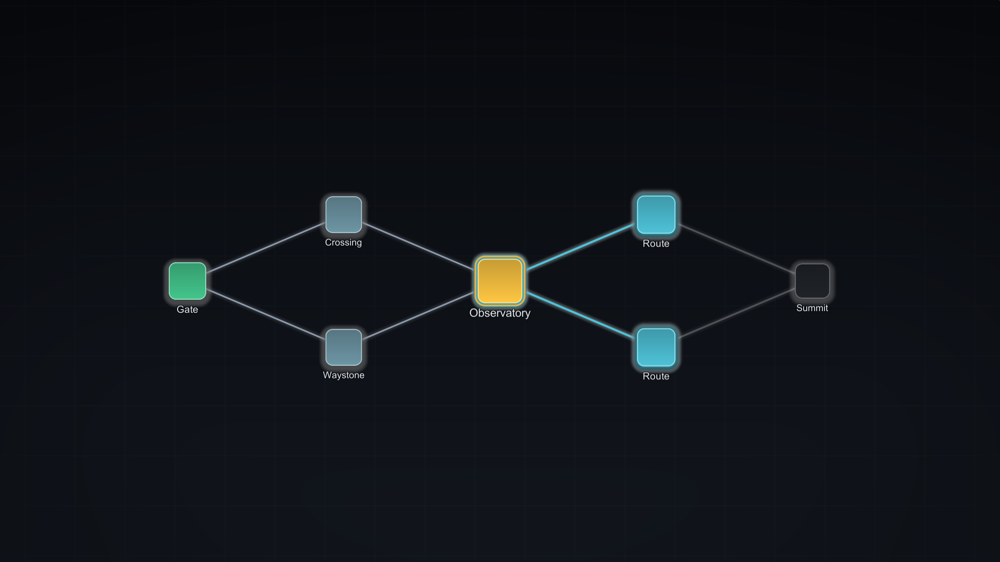

---
hide:
  - navigation
---

<div class="hero" markdown>

# BranchWeaver

<p class="tagline">Deterministic branching maps for Unity. Generate route maps, overworld webs,
and chapter gates from rules &mdash; then traverse, save, and present them without writing
rendering code.</p>

</div>

<figure markdown>
  { .shot }
  <figcaption>A BranchWeaver map using Slate Nocturne. Nodes, routes, rings and glow are signed-distance-field shapes drawn by one unlit shader, so they stay crisp at any zoom and need no post-processing.</figcaption>
</figure>

---

## Watch the editor walkthroughs

[Create and configure a starter map](tutorials/create-a-playable-map.md#starter-authoring-video)
(2 min 48 s) · [Save and restore a route](tutorials/create-a-playable-map.md#starter-runtime-video)
(50 s). Both videos have English captions and selectable chapters.

## Choose your path

<div class="cards" markdown>

<div markdown>

### See it work

Open both shipped samples and walk a map with mouse, keyboard, or touch.

[Install and run the samples](tutorials/install-and-samples.md)

</div>

<div markdown>

### Author an experience

Preview a preset, apply or undo visual changes, switch backend, and create a demo scene.

[Open Experience Studio](tutorials/experience-studio.md)

</div>

<div markdown>

### Generate from rules

Generate a map from a seed, reproduce it exactly, and audit a range of seeds.

[Generate a map in Map Studio](tutorials/generate-a-map.md)

</div>

<div markdown>

### Match your game

Copy a shipped style into an asset you own and edit it against a live preview.

[Restyle your map](tutorials/restyle-your-map.md)

</div>

<div markdown>

### Wire it up

Traversal events, payloads, save slots, and generating a graph with no scene.

[Drive traversal from code](how-to/drive-traversal-from-code.md)

</div>

</div>

## What it does

You give BranchWeaver **rules**: how many layers, how wide each layer may be, which node
types may sit where, and how many edges may leave or enter a node. It gives you a
**graph**, deterministic from a seed. A **session** owns traversal, a **presenter** draws
what the session reports, and a **style** decides how that drawing looks.

The same rules and seed always produce the same graph, on every machine and platform. That is
structural rather than promised: `BranchWeaver.Core` is compiled with `noEngineReferences: true`,
so it cannot reach `UnityEngine.Random`, `Time`, or a `GameObject` even by accident.

BranchWeaver does not own encounters, rewards, scenes, or quests. It reports what the
player did and leaves those decisions to your code.

### In code

=== "Rules to graph"

    ```csharp
    var compiler = new MapAuthoringCompiler();
    MapRulesCompilation rules = compiler.CompileRules(rulesAsset);

    var generator = new LayeredMapGenerator();
    MapGenerationResult result = generator.Generate(
        new MapGenerationRequest(rules.Value, seed: 12345u));

    MapGraph graph = result.Graph;   // same seed, same graph, always
    ```

=== "Walking it"

    ```csharp
    MapTransitionResult move = session.TryEnter(nodeId);
    if (!move.Succeeded)
    {
        // Illegal moves are data, not exceptions.
        return;
    }

    session.CompleteCurrent();   // content finished
    ```

=== "Restyling it"

    ```csharp
    presenter.ApplyStyle(nightStyle);   // pushed to every live view

    // A style can never change the map. It is presentation only.
    ```

## Requirements

| Item | Detail |
| --- | --- |
| Unity | 2022.3.62f1 serialization baseline; current Experience Studio validation in 6000.3.25f1 |
| Required package | uGUI (`com.unity.ugui`), present in standard Unity projects |
| Optional package | `com.unity.inputsystem`, which compiles the typed input bridge in |
| Experience Studio backends | Canvas, World2D, World3D, and UI Toolkit |
| Render pipeline | Built-in is the verified baseline; URP and HDRP are pending current Experience Studio verification |
| Dependencies | No paid dependency, no DLL, no DRM, no telemetry, no network service |

!!! note "Validation scope"
    The current Unity 6000.3.25f1 task passed 597 EditMode cases (two Windows-only cases
    ignored on Linux) and 28 PlayMode cases. The native Studio walkthrough demonstrates
    editing, applying, and changing the presentation backend. Broader version, platform,
    hardware-input, and pipeline coverage remains pending. BranchWeaver.Core retains its
    Unity 2022.3 compatibility contract. The UI Toolkit
    Experience Studio backend is compiled and registered only with `UNITY_6000_3_OR_NEWER`.
    The evidence and pending list ship in the package, at
    `Assets/BranchWeaver/Documentation/Compatibility-and-Release.md`.

!!! info "Documentation only"
    This site documents BranchWeaver. The product source is not published here.

## Next

- [Install and run the samples](tutorials/install-and-samples.md) &mdash; the shortest route from import to a map you can walk.
- [Experience Studio](tutorials/experience-studio.md) &mdash; preview, apply, and turn a preset into a demo scene.
- [Core concepts](explanation/architecture.md) &mdash; the pipeline stages and which stage decides what.
- [API reference](reference/index.md) &mdash; every public type, grouped by what it is for and filterable as you type.
