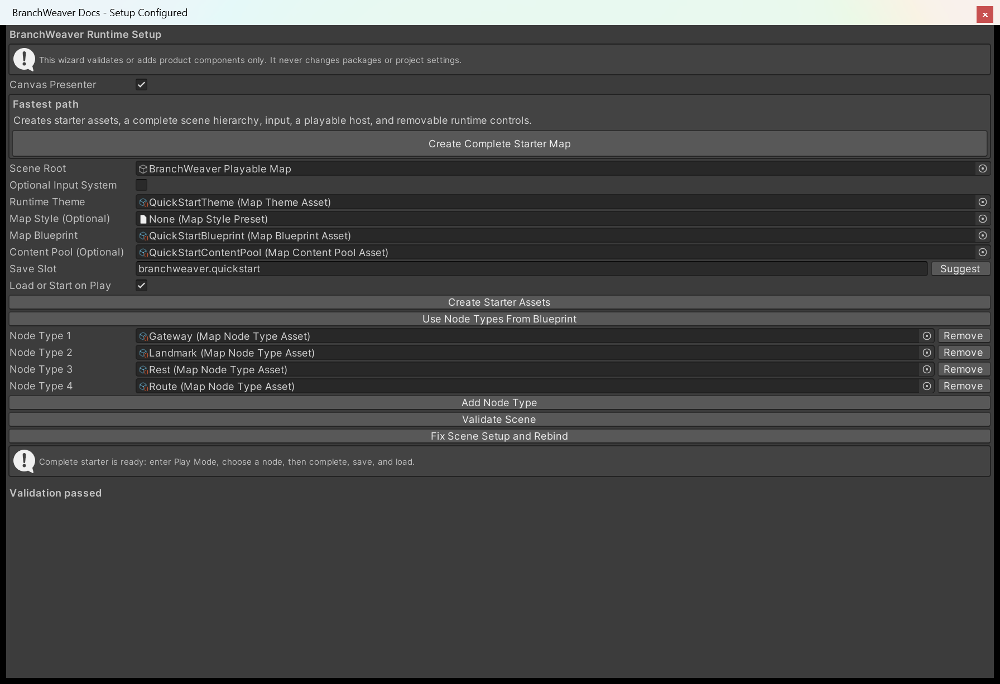

# 4. Add a map to your scene

The Setup Wizard also works on a scene you built yourself. Point it at a GameObject you own
and it adds the map components, builds the presentation objects below them, writes your assets
into the host, and validates the result, as one undoable step.

If you have no scene yet, [3. Create a playable map in one click](create-a-playable-map.md) is
faster, because it builds the scene as well. Use this page when the map has to live inside a
hierarchy that already exists.

## 1. Prepare a scene root

The wizard only modifies a GameObject in a loaded scene. Point it at a prefab or an asset and
it stops with `bw.setup.configure-scene-root-required` without touching anything. Everything it
creates lives under the root you choose; it adds and validates BranchWeaver components only, and
never changes packages or project settings.

=== "Canvas presenter"

    Add a Canvas to the scene (**GameObject > UI > Canvas**), then create a child object under
    it to serve as the setup root. The root needs a `RectTransform`, and a `Canvas` at or above
    it. Without both, the wizard refuses with `bw.setup.configure-canvas-root-invalid`.

    Keep the `EventSystem` Unity creates next to a new Canvas. Keyboard, controller, and pointer
    navigation need one, and validation warns when the scene has none.

=== "World2D presenter"

    Any empty GameObject in the scene works as the root, at whatever position you want the map
    to sit. Validation warns when the scene has no camera.

## 2. Open the Setup Wizard

**Tools > BranchWeaver > Setup Wizard** opens the **BranchWeaver Setup** window. Selecting your
root before you open it fills **Scene Root** in for you.

<figure markdown>
  { .shot }
  <figcaption>The window as it opens. The one-click starter at the top belongs to tutorial 3;
  the fields under it are what this page uses. <strong>Validate Scene</strong> and the configure
  button below them stay disabled until <strong>Scene Root</strong> holds a scene object and
  <strong>Save Slot</strong> is a valid stable ID.</figcaption>
</figure>

## 3. Fill in the fields

| Field | What it does |
| --- | --- |
| **Canvas Presenter** | On, you get a screen-space uGUI map. Off, an in-scene World2D map. On by default. |
| **Scene Root** | The object the setup is built on. Drag your root here. |
| **Optional Input System** | On, the Input System bridge and its signal adapter are added and bound when that package is present. Off, both are removed and the built-in input path is used. |
| **Runtime Theme** | Layout and spacing. Written into the host. |
| **Map Style (Optional)** | Leave it empty and the presenter keeps the look it already has, which is what the Style Browser writes. Fill it in and the host becomes the one place the look is decided. |
| **Map Blueprint** | The map the host generates. Assigning one also fills in the node type rows below and suggests a save slot. |
| **Content Pool (Optional)** | Which content ID each node hands your game. Leave it empty if your game picks its own. |
| **Save Slot** | The name this map's saves are written under. It must be a stable ID, and cannot be `.` or `..`. **Suggest** derives a safe one from the blueprint or the root. |
| **Load or Start on Play** | On, the host loads that slot when Play starts and generates a new map only when nothing is saved. |
| **Node Type _n_** | One node type per row, each compiled by validation. **Add Node Type** adds a row, **Remove** drops one, and **Remove Empty Node Type Rows** clears any left blank. |

Two buttons save typing. **Create Starter Assets** writes a complete set of node types, rules, a
theme, a blueprint, and a content pool into a folder you choose inside `Assets`, and assigns
them. **Use Node Types From Blueprint** reads every node type the assigned blueprint's rules
mention and fills the rows with them, in a stable order.

An invalid **Save Slot** is caught where you type it, with **Fix Save Slot** underneath, because
the configure button will not run until it is valid.

## 4. Press Configure Selected Scene Root

That button creates and wires the hierarchy, writes your assets into the host, and validates
what it made. Once a `BranchWeaverMapHost` is on the root it is labelled **Fix Scene Setup and
Rebind** instead, and does the same job: repair anything missing and re-bind everything to the
current fields.

<figure markdown>
  { .shot }
  <figcaption>A configured example after the root and sample assets have been bound. Your asset
  names can differ; the useful check is <strong>Validation passed</strong> at the bottom.</figcaption>
</figure>

A refusal appears as a dialog naming its code. **Validate Scene** re-runs the checks on their
own and changes nothing.

### What reaches the scene

The blueprint, theme, style, content pool, **Load or Start on Play**, and **Save Slot** are all
written into `BranchWeaverMapHost` when the button runs. That is what makes the map playable
without code.

The node type rows are the exception. They are read by validation only, so that it can compile
the exact set you intend to ship and tell you whether it presents. They are never written into
the scene.

Validation judges a complete runtime setup, so with no blueprint assigned it always reports
`bw.setup.graph-missing`, and with no theme, `bw.setup.theme-invalid`.

## 5. Read the validation report

Errors mean the map will not present. Warnings do not: a missing `EventSystem`, no camera for
World2D, an unavailable Input System package, or a root that has no host yet.

<figure markdown>
  { .shot }
  <figcaption>An intentionally incomplete setup. The save-slot problem has a visible repair
  action, and the validation list states the missing scene pieces in plain language.</figcaption>
</figure>

Three contextual fixes appear under the report when they apply, and each one re-validates after
it runs.

| Fix | Appears when |
| --- | --- |
| **Fix: Suggest Safe Save Slot** | The save slot is not a usable stable ID. |
| **Fix: Use Blueprint Node Types** | A node type row is empty, duplicated, or missing a type the graph uses. |
| **Fix: Create or Rebind Scene Components** | The controller, host, presenter, input, hit tester, or the owned hierarchy is missing or unbound. |

Every diagnostic also carries a stable code. The **Details (codes to quote in a bug report)**
foldout under the report lists them, so you can look a symptom up in
[Troubleshooting](../how-to/troubleshooting.md) or paste it into a support message.

!!! tip
    The wizard is also the fastest check on a scene you set up months ago: select its root and
    press **Validate Scene**. Nothing is modified, and you get the same list.

## 6. Press Play

With **Load or Start on Play** ticked, the host loads your save slot when Play begins and
generates a new map only when nothing is saved yet. The map draws itself, available nodes are
bright, and clicking one enters it. Nothing else is required of you.

If you would rather decide when the map appears, untick it and start the map from your own
button or script instead. Both routes are in
[Drive traversal from code](../how-to/drive-traversal-from-code.md).

## What the wizard adds

Five components go on the root itself.

| Component | What it owns |
| --- | --- |
| `BranchWeaverMapHost` | Compiling the blueprint, generating or loading the map, routing content, and the save boundary. |
| `MapTraversalController` | The graph, the session, progression state, and the runtime events. |
| `MapInputController` | Turning pointer, keyboard, and touch input into selection requests. |
| `DefaultMapNodeHitTester` | Deciding which node a pointer is over. |
| `MapSetupHierarchyBinding` | The record of which objects the wizard created and owns. |

Below the root it creates the presentation objects for the renderer you chose.

=== "Canvas presenter"

    ```text
    Scene Root
      BranchWeaver Safe Area        RectTransform stretched to the parent, MapSafeAreaController
        BranchWeaver Map Content    RectTransform, CanvasMapPresenter
    ```

    The safe-area object re-anchors itself to the device safe area when the screen size or safe
    area changes, so a notch never covers the map.

=== "World2D presenter"

    ```text
    Scene Root
      BranchWeaver World Content    WorldMapPresenter
    ```

    The camera is resolved for you: an explicit main camera if there is one, otherwise the first
    active camera in the scene.

The presenter is pointed at the traversal controller, the host at the controller and the
presenter, the input controller at the controller, the presenter, the content transform, and the
hit tester, and all of it is serialized so nothing has to be re-resolved at play time. The whole
operation collapses into one undo step named *Configure BranchWeaver Runtime*.

### Running it a second time

Re-running is safe. Switching the presenter toggle rebuilds the owned objects for the other
renderer, and a hierarchy that no longer matches its binding is repaired the same way. Two cases
stop instead of guessing:

- `bw.setup.configure-customer-content-present` - an owned object contains something the wizard
  does not recognise. Reparent your content, then run it again.
- `bw.setup.configure-ownership-ambiguous` - presenters exist below the root with no ownership
  record. Remove them, or restore the binding.

## Add the viewport frame yourself

The wizard does not add `MapViewportFrame`: where the map sits on screen is a layout decision,
not a setup default. Without it, the content fills the rect it is parented to.

Add **BranchWeaver > Map Viewport Frame** to the **BranchWeaver Safe Area** object, set
**Presenter** to the `CanvasMapPresenter` and **Content** to the `BranchWeaver Map Content`
rect. The frame treats the rect it sits on as the area the map may use, and scales and positions
the Content rect inside it, re-fitting whenever the screen size or safe area changes.

Its margins, fit mode, padding, and pan and zoom limits come from the presenter's style, so
placement is edited in a style asset rather than by dragging transforms. `FrameAll()` refits the
whole map, `FocusOn(nodeId)` centres a node, and `Zoom` multiplies the fitted scale. The
component requires a `RectTransform`, so it applies to the Canvas presenter; for World2D, frame
the map by placing and sizing the camera.

## Next

- **[5. Restyle your map](restyle-your-map.md)** - the presenter uses the shipped default style
  until you assign one. This is how you assign your own.
- **[Place the map on screen](../how-to/place-the-map-on-screen.md)** - margins, fit modes,
  aspect ratios, and reserving space for your own interface.
- **[Drive traversal from code](../how-to/drive-traversal-from-code.md)** - reading progression,
  reacting to node content, and moving the traveller yourself.
