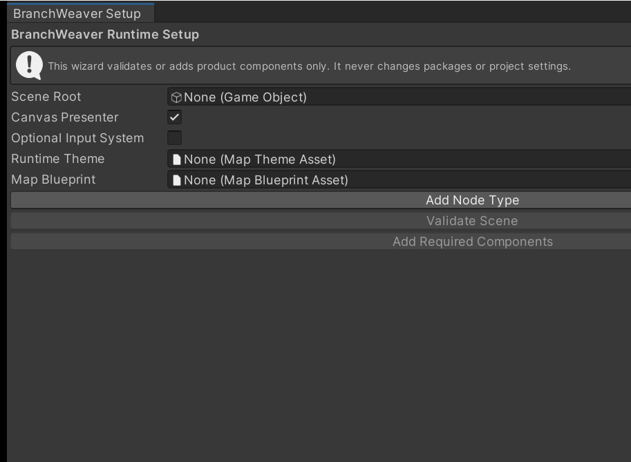

# 3. Add a map to your scene

The Setup Wizard builds and wires a map hierarchy in a scene you own, as one undoable
step. This page covers what it needs from you, what it creates, and what it deliberately
leaves for you to add.

## Prepare a scene root

The wizard only modifies a GameObject in a loaded scene. Point it at a prefab or an asset
and it stops with `bw.setup.configure-scene-root-required` without touching anything.
Everything it creates lives under the root you choose; it adds and validates BranchWeaver
components only, and never changes packages or project settings.

=== "Canvas presenter"

    Add a Canvas to the scene (**GameObject > UI > Canvas**), then create a child object
    under it to serve as the setup root. The root needs a `RectTransform`, and a `Canvas`
    at or above it. Without both, the wizard refuses with
    `bw.setup.configure-canvas-root-invalid`.

    Keep the `EventSystem` Unity creates next to a new Canvas. Keyboard, controller, and
    pointer navigation need one, and validation warns when the scene has none.

=== "World2D presenter"

    Any empty GameObject in the scene works as the root, at whatever position you want
    the map to sit. Validation warns when the scene has no camera.

## Run the Setup Wizard

**Tools > BranchWeaver > Setup Wizard** opens the **BranchWeaver Setup** window.

<figure markdown>
  { .shot }
  <figcaption>Both buttons are disabled until <strong>Scene Root</strong> is set. Node type
  slots appear above them as <strong>Add Node Type</strong> adds each one.</figcaption>
</figure>

| Field | What it does |
| --- | --- |
| **Scene Root** | The object the setup is built on. Both buttons stay disabled until this is set. |
| **Canvas Presenter** | On, you get a screen-space uGUI map. Off, an in-scene World2D map. On by default. |
| **Optional Input System** | On, the Input System bridge and its signal adapter are added and bound when that package is present. Off, both are removed and the built-in input path is used. |
| **Runtime Theme** | The theme that validation compiles and checks. |
| **Map Blueprint** | The blueprint validation compiles into a graph to check the scene against. |
| **Node Type _n_** | One node type per slot, each compiled by validation. **Add Node Type** adds a slot, **Remove** drops one. |

**Add Required Components** creates and wires the hierarchy, then validates it. A refusal
appears as a dialog naming its code. **Validate Scene** re-runs the checks on their own.

### What the asset fields are and are not

The theme, blueprint, and node types are read by validation only. **Add Required
Components** never writes them into the scene: they reach a running map through code, not
through the wizard. Assign them so validation can tell you whether the set you intend to
ship actually presents.

Validation judges a complete runtime setup, so with no blueprint assigned it always
reports `bw.setup.graph-missing`, and with no theme, `bw.setup.theme-invalid`. Errors mean
the map will not present; warnings — a missing `EventSystem`, no camera for World2D, an
unavailable Input System package — do not.

!!! tip
    The wizard is also the fastest check on a scene you set up months ago: select its root
    and press **Validate Scene**. Every diagnostic names its own code, so you can look the
    symptom up in [Troubleshooting](../how-to/troubleshooting.md).

## What the wizard adds

Four components go on the root itself.

| Component | What it owns |
| --- | --- |
| `MapTraversalController` | The graph, the session, progression state, and the runtime events. |
| `MapInputController` | Turning pointer, keyboard, and touch input into selection requests. |
| `DefaultMapNodeHitTester` | Deciding which node a pointer is over. |
| `MapSetupHierarchyBinding` | The record of which objects the wizard created and owns. |

Below the root it creates the presentation objects for the renderer you chose.

=== "Canvas presenter"

    ```text
    Scene Root
    └─ BranchWeaver Safe Area      RectTransform stretched to the parent, MapSafeAreaController
       └─ BranchWeaver Map Content RectTransform, CanvasMapPresenter
    ```

    The safe-area object re-anchors itself to the device safe area when the screen size or
    safe area changes, so a notch never covers the map.

=== "World2D presenter"

    ```text
    Scene Root
    └─ BranchWeaver World Content  WorldMapPresenter
    ```

    The camera is resolved for you: an explicit main camera if there is one, otherwise the
    first active camera in the scene.

The presenter is pointed at the traversal controller, the input controller is pointed at
the controller, the presenter, the content transform, and the hit tester, and all of it is
serialized so nothing has to be re-resolved at play time. The whole operation collapses
into one undo step named *Configure BranchWeaver Runtime*.

### Running it a second time

Re-running is safe. Switching the presenter toggle rebuilds the owned objects for the
other renderer, and a hierarchy that no longer matches its binding is repaired the same
way. Two cases stop instead of guessing:

- `bw.setup.configure-customer-content-present` — an owned object contains something the
  wizard does not recognise. Reparent your content, then run it again.
- `bw.setup.configure-ownership-ambiguous` — presenters exist below the root with no
  ownership record. Remove them, or restore the binding.

!!! warning
    A wired hierarchy is not yet a map. Nothing is drawn until
    `MapTraversalController.Initialize` is called with a graph and compiled runtime content
    — code you write once, covered in
    [Drive traversal from code](../how-to/drive-traversal-from-code.md). To watch a map
    move before writing any, open [a sample](install-and-samples.md).

## Add the viewport frame yourself

The wizard does not add `MapViewportFrame`: where the map sits on screen is a layout
decision, not a setup default. Without it, the content fills the rect it is parented to.

Add **BranchWeaver > Map Viewport Frame** to the **BranchWeaver Safe Area** object, set
**Presenter** to the `CanvasMapPresenter` and **Content** to the `BranchWeaver Map
Content` rect. The frame treats the rect it sits on as the area the map may use, and
scales and positions the Content rect inside it, re-fitting whenever the screen size or
safe area changes.

Its margins, fit mode, padding, and pan and zoom limits come from the presenter's style,
so placement is edited in a style asset rather than by dragging transforms. `FrameAll()`
refits the whole map, `FocusOn(nodeId)` centres a node, and `Zoom` multiplies the fitted
scale. The component requires a `RectTransform`, so it applies to the Canvas presenter;
for World2D, frame the map by placing and sizing the camera.

## Next

- **[4. Restyle your map](restyle-your-map.md)** — the presenter uses the shipped default
  style until you assign one. This is how you assign your own.
- **[Place the map on screen](../how-to/place-the-map-on-screen.md)** — margins, fit
  modes, aspect ratios, and reserving space for your own interface.
- **[Drive traversal from code](../how-to/drive-traversal-from-code.md)** — initialising
  the controller, reading progression, and moving the traveller.
