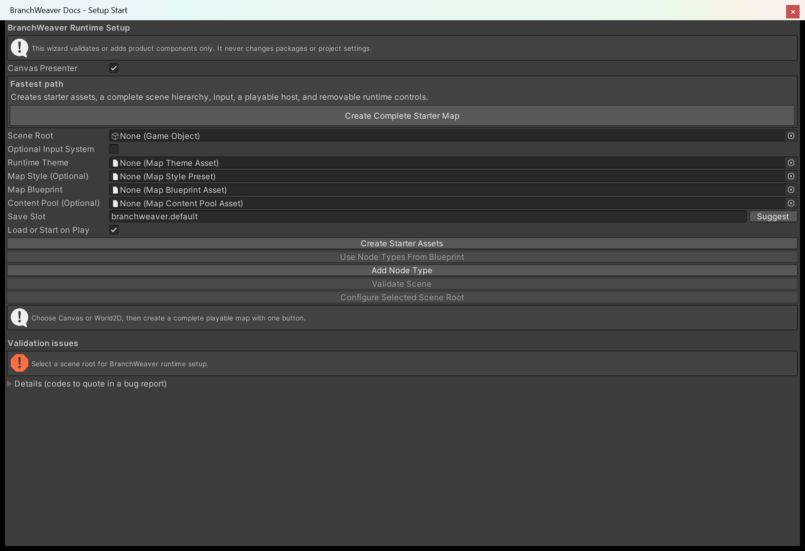
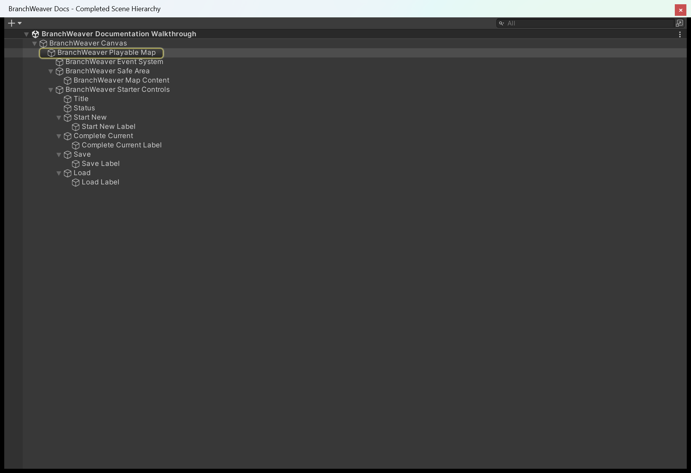
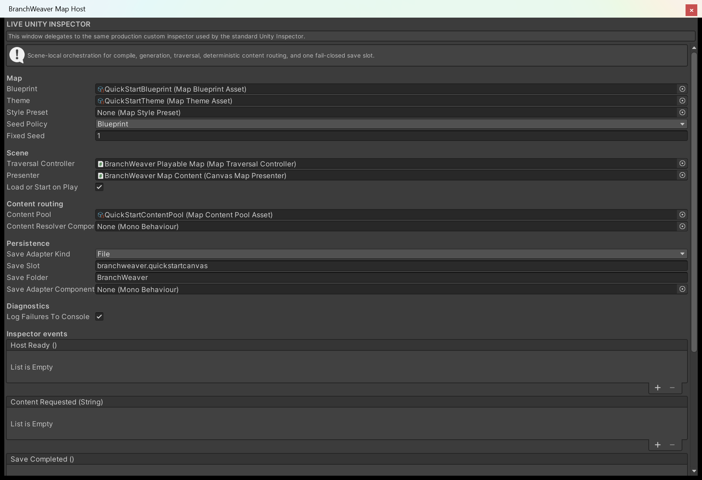
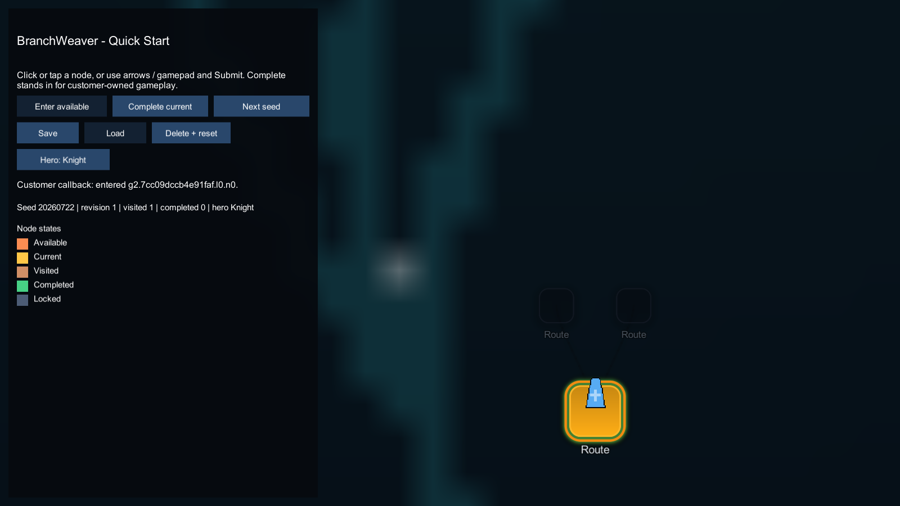
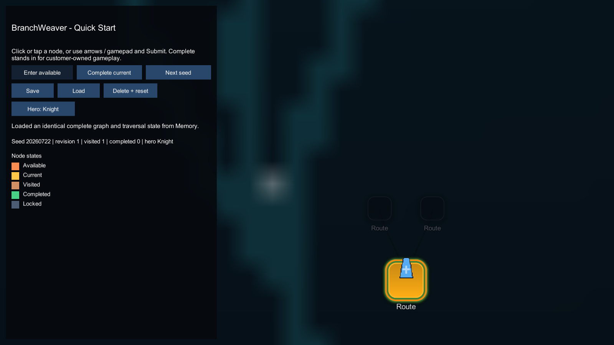

# 3. Create a playable map in one click

One button builds a whole map: the assets, the Canvas or the camera, the host, the traversal
controller, the presenter, input, hit testing, and a small control panel you can press in Play
Mode. You do not need a scene root, a Canvas, an `EventSystem`, or a single asset before you
start, and you do not write any C#.

This is the fastest route from an empty scene to a map you can click.
[4. Add a map to your scene](add-a-map-to-your-scene.md) covers the other direction: fitting a
map into a scene you have already built.

## 1. Open the Setup Wizard

**Tools > BranchWeaver > Setup Wizard**. Nothing has to be selected in the Hierarchy, and the
scene can be empty.

<figure markdown>
  { .shot }
  <figcaption>The window as it opens. <strong>Create Complete Starter Map</strong> sits under
  <strong>Fastest path</strong> and is the only control this page uses. The validation issue below
  reports that the manual setup path has no scene root; the one-click path does not need one.</figcaption>
</figure>

## 2. Choose Canvas or World2D

**Canvas Presenter** is ticked by default and gives you a screen-space uGUI map that scales
with the window. Untick it for World2D, an in-scene map drawn in front of a camera.

Everything below is the same either way. Running the wizard again with the other setting
rebuilds the presentation for that renderer.

## 3. Press Create Complete Starter Map

The wizard creates a new folder, `Assets/BranchWeaverStarter`, and writes eight assets into
it. If that folder name is taken it uses `BranchWeaverStarter1`, `BranchWeaverStarter2`, and so
on, so pressing the button twice never overwrites the first result.

| Asset | What it holds |
| --- | --- |
| `Route`, `Rest`, `Landmark`, `Gateway` | One node type each, with a stable ID such as `starter.route` and a display label. |
| `Starter Rules` | Four layers holding 1, 2, 2 and 1 nodes; type weights Route 6, Rest 2, Landmark 2, Gateway 1; at most two routes out of and into any node; crossing routes forbidden. |
| `Starter Theme` | Vertical layout, curved routes, layer spacing 150, node spacing 110, zoom clamped to 0.65 - 2.2. |
| `Starter Blueprint` | The rules above, procedural mode, preview seed 20260801. This is what the host generates from. |
| `Starter Content Pool` | Three weighted rows filtered by node type, so every node you enter hands your game a content ID. |

In the scene it then builds the hierarchy, adds the components, points them at each other,
writes the new assets into the host, and validates the result. A save slot is derived from the
folder name, so this map is `branchweaver.branchweaverstarter` and cannot collide with another
map's save.

The whole thing is one undo step named *Create BranchWeaver Playable Map*. If any part of it
fails, the objects and the asset folder are removed again and the validation report at the
bottom of the window says what stopped it. It never installs a package or changes a project
setting.

The status line reports success: *Playable starter created. Enter Play Mode, select a node,
then use the starter controls to complete, save, and load.*

## 4. Look at what you got

The new **BranchWeaver Playable Map** object is selected for you.

<figure markdown>
  { .shot }
  <figcaption>The Canvas object tree created in one step. The selected playable-map root owns the
  runtime components; its presentation and removable sample controls are visible below it.</figcaption>
</figure>

=== "Canvas presenter"

    ```text
    BranchWeaver Canvas                     Canvas, CanvasScaler, GraphicRaycaster
      BranchWeaver Playable Map             the five components below
        BranchWeaver Safe Area              MapSafeAreaController
          BranchWeaver Map Content          CanvasMapPresenter
        BranchWeaver Starter Controls       MapHostStarterPanel
    ```

    A `BranchWeaver Event System` object is added under the map root when the scene has none,
    because keyboard, controller, and pointer navigation need one. A scene that already has an
    `EventSystem` keeps it.

=== "World2D presenter"

    ```text
    BranchWeaver Playable Map               the five components below
      BranchWeaver Camera                   orthographic, only when the scene has no camera
      BranchWeaver World Content            WorldMapPresenter
      BranchWeaver Controls Canvas          Canvas, CanvasScaler, GraphicRaycaster
        BranchWeaver Starter Controls       MapHostStarterPanel
    ```

    The starter controls get their own screen-space Canvas here, since the map itself is not
    drawn on one. A `BranchWeaver Event System` object is added under the map root when the
    scene has none.

Five components go on the root object: `BranchWeaverMapHost`, `MapTraversalController`,
`MapInputController`, `DefaultMapNodeHitTester`, and `MapSetupHierarchyBinding`, which is the
record of what the wizard created and owns.

## 5. Read the host

Select the root and look at **Branch Weaver Map Host**. This is the one component you will
touch again, and every field on it was filled in for you.

<figure markdown>
  { .shot }
  <figcaption>The host holds the recipe (blueprint, theme, style, seed policy), the scene wiring
  it drives, where node content comes from, and where a run is saved. The event lists at the
  bottom are how your own scripts and buttons hook in later.</figcaption>
</figure>

| Group | What it decides |
| --- | --- |
| **Map** | Which blueprint and theme are compiled, the optional style preset, and whether the seed comes from the blueprint or from **Fixed Seed**. |
| **Scene** | The controller and presenter the host drives, and **Auto Start**: load the save slot on Play, and generate a new map only when there is nothing saved. |
| **Content routing** | The content pool that answers "what is in this node", or your own resolver component. |
| **Persistence** | **Save Adapter Kind** (File by default, written under a folder of your naming inside Unity's persistent data path), and the save slot for this map. |
| **Inspector events** | `Host Ready`, `Content Requested`, `Save Completed`, and `Host Failed`, wired from the inspector like any UnityEvent. |

## 6. Press Play

The map generates and draws itself. Available nodes are bright, locked nodes are dimmed, and
the node you occupy is ringed.

<figure markdown>
  { .shot }
  <figcaption>This recorded frame is the shipped Quick Start sample and shows the Canvas node
  states after traversal. It illustrates the presenter and state styling, not the exact contents
  of the generated starter panel.</figcaption>
</figure>

1. Click a bright node, or move focus with the arrow keys and press ++enter++.
2. Read the panel. The line beginning **Content requested:** names the content ID the pool chose
   for that node, `starter.encounter` on a Route or Landmark node from the starter set. That ID
   is BranchWeaver telling your game which encounter to open. It does not open anything itself,
   load a scene, or grant a reward.
3. Press **Complete Current**. That stands in for your content finishing, and it unlocks
   whatever the completed node leads to.

## 7. Save, then load

1. Press **Save**. The whole run is written to the slot: the graph, your route through it, the
   selection history, and the content that is active right now.
2. Press **Load**.

<figure markdown>
  { .shot }
  <figcaption>The sample confirms that the complete graph and traversal state came back from
  memory, with the same node still current.</figcaption>
</figure>

A save that cannot be trusted is refused rather than repaired: a corrupt file, a save written
against a different blueprint, or content that no longer exists all fail closed and report why.
The live run is left alone in every one of those cases.

## 8. Make it yours

The starter panel is ordinary uGUI and is not part of the package's runtime. Delete
**BranchWeaver Starter Controls** whenever you want and drive the host from your own interface
instead: its `Start New`, `Complete Current`, `Save`, and `Load` are public host operations, and
`Content Requested` carries the ID of the thing your game should open.

The assets in `Assets/BranchWeaverStarter` are yours too. Edit the rules to change the shape of
the map, the node types to change what a node means, and the content pool to change what each
node hands you.

!!! tip "Keep the save slot stable once you ship"
    A saved run remembers which blueprint and which content pool produced it. Renaming a
    blueprint recipe or changing a resolver after players have saves is a migration decision,
    not a free edit. Give each map its own slot and leave it alone.

## Next

- **[4. Add a map to your scene](add-a-map-to-your-scene.md)** - the same components, added to a
  scene root you already own, with your own assets.
- **[5. Restyle your map](restyle-your-map.md)** - the starter map draws with the shipped
  default. This is how you make it yours.
- **[Save and load progress](../how-to/save-and-load.md)** - slots, adapters, and what a save
  envelope actually contains.
- **[Drive traversal from code](../how-to/drive-traversal-from-code.md)** - when you are ready
  to replace the starter panel with your own flow.
