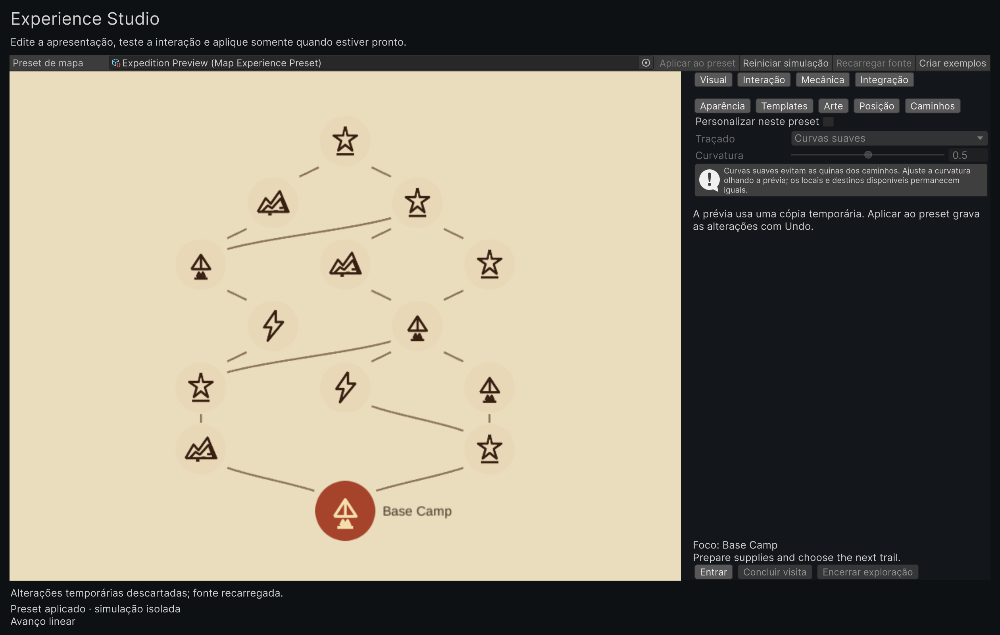
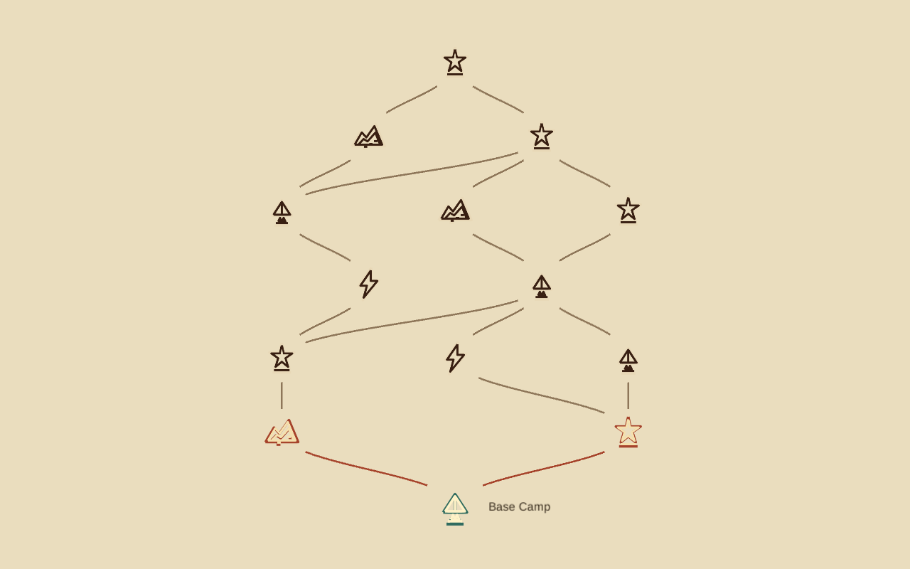
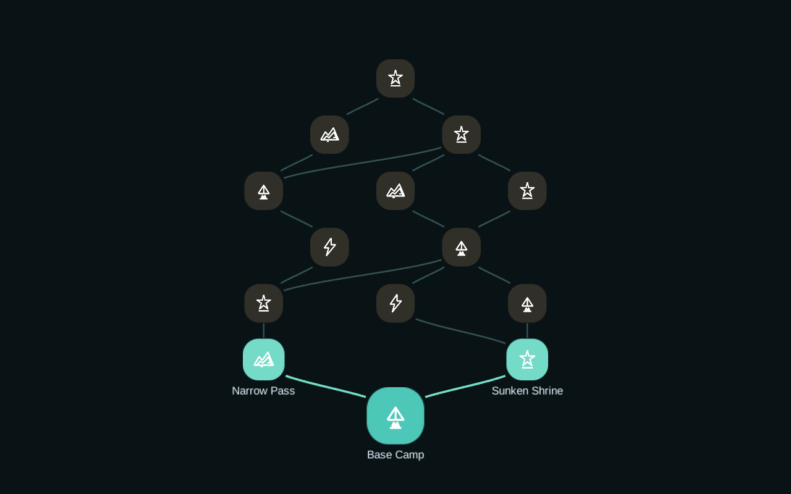
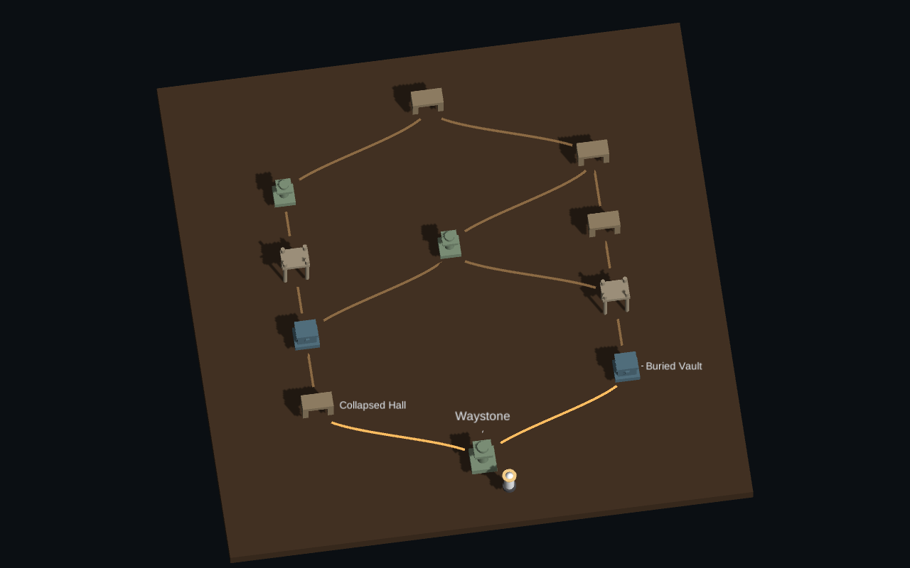
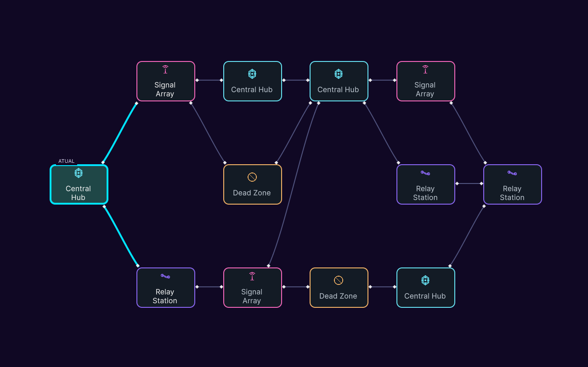
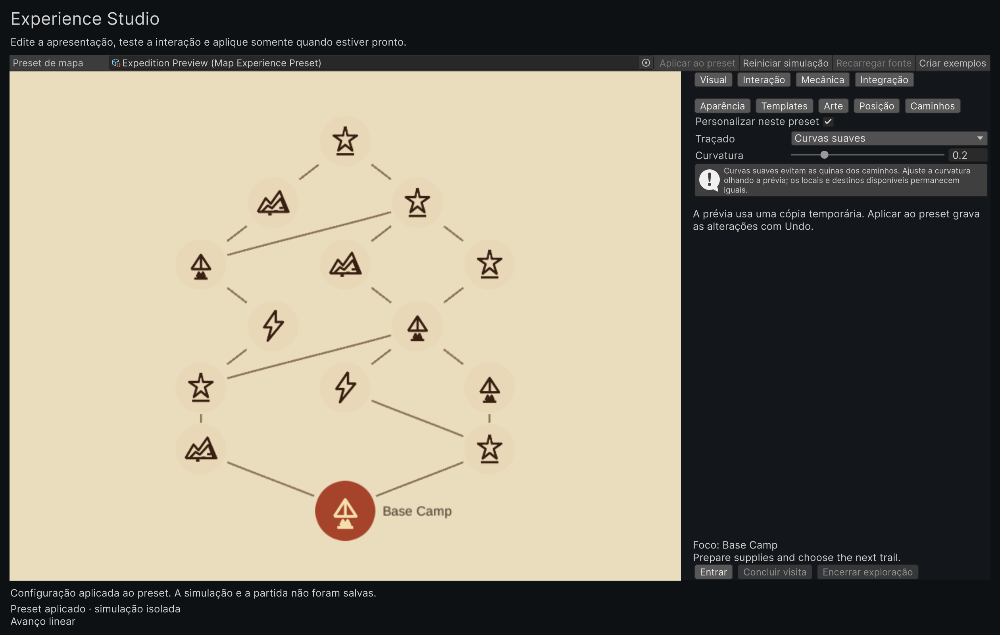
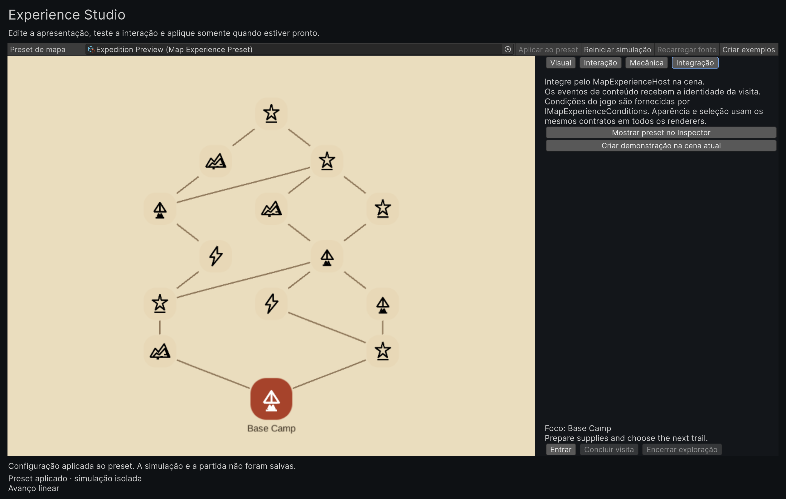
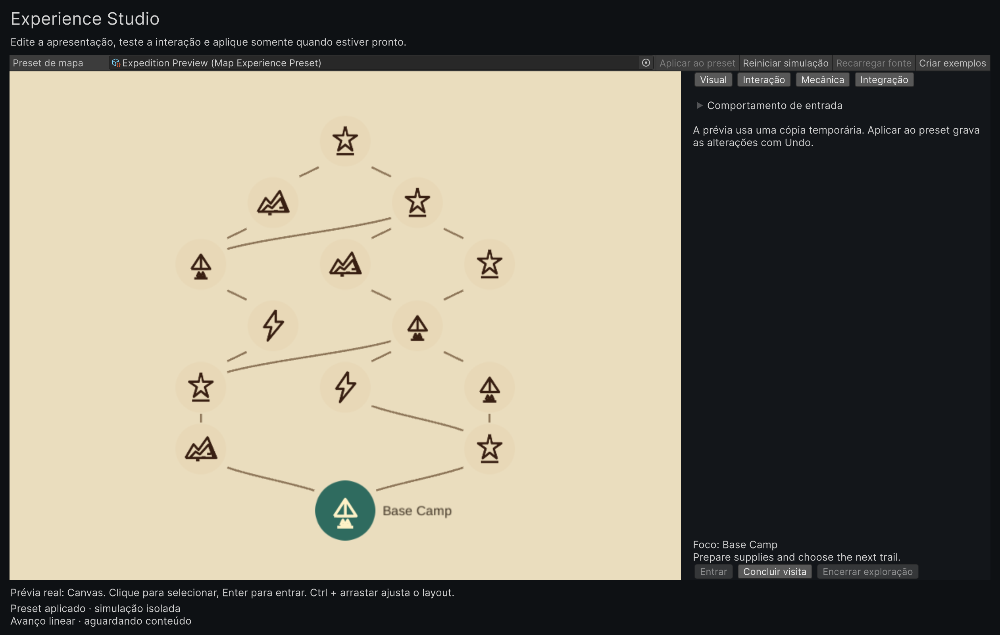
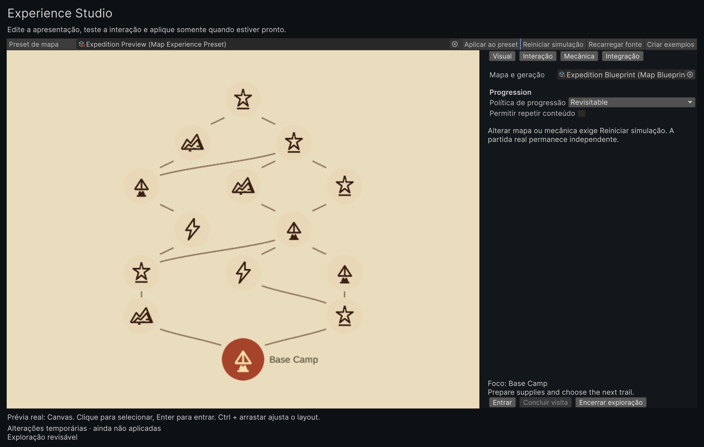

# 2. Experience Studio: preview, apply, and create a demo

Experience Studio is the authoring path for a complete map presentation. It edits a
`MapExperiencePreset` in a temporary working copy, previews that copy, and saves only when
you choose **Apply to preset**. The graph, progression policy, content contract, and
presentation backend remain explicit parts of the preset.

This page documents the shipped editor flow. Follow the steps in order, then use the saved
preset when you create a demo scene.

**Scope of this walkthrough:** the controls below cover choosing a preset, previewing an edit,
applying it, switching the renderer, and opening the integration action. For small labels in
the recording, use the player's fullscreen control. The capture boundary and validation details
are listed in the [technical media receipt](../assets/videos/studio-authoring-native.receipt.json).

<figure class="studio-video">
  <video id="studio-authoring-video" controls preload="metadata" poster="../../assets/images/studio-curves-applied.png" aria-describedby="studio-video-transcript">
    <source src="../../assets/videos/studio-authoring-native.mp4" type="video/mp4">
    <track kind="captions" src="../../assets/videos/studio-authoring-native.vtt" srclang="en" label="English captions" default>
    Your browser does not support HTML video. Use the transcript below.
  </video>
  <figcaption>Native Studio capture: paths, a draft curve edit, Apply, World2D, and Integration.</figcaption>
</figure>

  <button type="button" data-studio-time="0">0:00 discard</button>
  <button type="button" data-studio-time="2.1">0:02 paths</button>
  <button type="button" data-studio-time="5.1">0:05 draft</button>
  <button type="button" data-studio-time="8.6">0:09 apply</button>
  <button type="button" data-studio-time="10.1">0:10 World2D</button>
  <button type="button" data-studio-time="13.1">0:13 Integration</button>

Use fullscreen when reading small labels in the recording.

  
Accessible transcript and timestamps

  <ol>
    <li><button type="button" data-studio-time="0">0:00</button> The source preset is shown with no pending edit.</li>
    <li><button type="button" data-studio-time="2.1">0:02</button> The Paths controls are visible for the inherited route.</li>
    <li><button type="button" data-studio-time="5.1">0:05</button> A gentle curve edit is visible in the temporary draft.</li>
    <li><button type="button" data-studio-time="8.6">0:09</button> Apply commits the edit and clears the draft state.</li>
    <li><button type="button" data-studio-time="10.1">0:10</button> The presentation backend changes to World2D in the draft.</li>
    <li><button type="button" data-studio-time="13.1">0:13</button> Integration shows the saved-backend scene action.</li>
  </ol>

The capture shows action labels such as `Aplicar ao preset`, `Recarregar fonte`, and
<code>Integra&ccedil;&atilde;o</code>; these labels are shown exactly as captured.

## 1. Open the Studio and choose a preset

Open **Tools > BranchWeaver > Experience Studio**, then assign a `MapExperiencePreset`.
The window is divided into four task tabs:

| Tab | Use it for |
| --- | --- |
| **Visual** | Appearance, templates, node art, positions, and route geometry |
| **Interaction** | Input and focus behaviour |
| **Mechanics** | Progression policy and repeat completion |
| **Integration** | Host, renderer, camera, light, EventSystem, and optional demo HUD |

Visual authoring is grouped into Appearance, Templates, Art, Position, and Paths subtabs.
This keeps the controls discoverable without putting every field in one scrolling inspector.
Changes update the preview as you edit. Dragging a visible node changes its presentation offset
only; it does not change topology, stable IDs, or save data. Hold Ctrl while dragging to edit
the layout offset in the preview.

{ .shot }

The screenshot is a native current capture of the Studio window. It shows the path controls and
the route state; it is not a preset-creation screen.

## 2. Create examples when you need a known starting point

Use **Tools > BranchWeaver > Create Experience Examples** to create four editable presets in a
new folder below `Assets`. The command opens the first preset in the Studio.

| Preset | Backend | Shape |
| --- | --- | --- |
| **Illustrated Expedition** | Canvas | 14-node vertical route |
| **Neon Network** | UI Toolkit | 12-node horizontal route |
| **Tabletop Journey** | World3D | 11-node exploration map |
| **World Trail** | World2D | Expedition route in the scene |

The examples use authored blueprints, themes, node types, sprites, templates, and (for Tabletop)
composite prefabs. World Trail uses the Expedition blueprint, theme, and authored art with its
World2D presentation. Procedural blueprints remain available when you want a seed-driven graph.
Changing the appearance or backend does not regenerate either kind of graph.

These native Unity captures show each preset after a first-visit flow and save restoration. They
show the map surface only; the optional demo HUD is not included. The node and edge counts vary
because the presets use different authored graphs.

{ .shot }

{ .shot }

{ .shot }

{ .shot }

The image hashes, renderer names, and graph counts are recorded in the [preset gallery receipt](../assets/videos/experience-gallery.receipt.json).

To choose World2D on another preset, open it in the Studio, set **Visual > Presentation** to
`World2D`, let the preview rebuild, then choose **Apply to preset**. In **Integration**,
**Create demo in current scene** uses that saved backend. The factory's World Trail preset is the
ready-made World2D route; a generated demo scene is created from the selected saved preset.

## 3. Apply or undo authoring changes

The preview is detached from the source preset. Use **Apply to preset** to persist visual and
interaction authoring changes with Unity Undo support. Use **Reload source** to discard the
working copy and reload the asset on disk. Undo and Redo update both the preview and manual art
and position fields.

If the source changed outside the Studio, Apply refuses to overwrite it. Reload source first.
When switching a changed preset, choose **Apply and switch**, **Discard and switch**, or
**Continue editing**. Closing follows Unity's normal save/discard flow.

{ .shot }

The draft preview is still temporary here. The captured Portuguese labels include
`Curvas suaves` and `Aplicar ao preset`.

{ .shot }

After Apply, the preview reports the edit as applied while the graph identity remains the same.

## 4. Create a demo scene from the saved preset

Apply the preset before creating a scene. In **Integration**, choose **Create demo in current
scene**. The command creates the host, the selected renderer, camera and light when needed,
an EventSystem, and the optional demo HUD. The action stays disabled while the preset has
unapplied changes, because scene creation reads the saved source rather than the temporary copy.

{ .shot }

This current capture shows the World2D backend selected in the temporary Studio state. Apply
the preset before creating the scene so Integration reads the saved backend.

{ .shot }

The Integration capture shows the scene action and backend state. It does not claim that a scene
was created in a running game.

The host exposes one snapshot contract to every backend. The registered backends are:

| Backend | Presentation space | Notes |
| --- | --- | --- |
| `Canvas` | Screen-space uGUI | Suitable for menus and overlay maps |
| `World2D` | In-scene 2D | Uses native Unity scene components |
| `World3D` | In-scene 3D | Preserves authored prefab materials by default |
| `UIToolkit` | UI Toolkit document | Compiled and registered only with `UNITY_6000_3_OR_NEWER` |

Canvas, World2D, and World3D use native Unity presentation components. BranchWeaver.Core stays
free of Unity references and remains compatible with Unity 2022.3. The UI Toolkit backend is
version guarded for Unity 6.3; this page does not imply that the backend is available in a
2022.3 project.

The host depends on `IMapExperienceRenderer`, so switching the renderer retains the graph,
progression policy, and current session. Optional renderer capabilities cover input, camera,
viewport reservation, picking, layout editing, UI Toolkit elements, and input ownership.

## 5. Connect game content with the visit token

The host raises `ContentRequested` with the node ID and an exact visit token. Store that token
with the content request and pass it back when the encounter finishes. The complete compilable
component is in [Route content to nodes](../how-to/route-content-to-nodes.md#experience-studio-hosts).

The token belongs to that visit. A delayed callback from an earlier visit is rejected, and
reading `CurrentVisitToken` only when an asynchronous result arrives can accidentally complete
a newer visit. Choose one content integration path for a game: host events or direct controller
events. Direct controller commands update the host snapshot and invalidate old tokens without
raising a second host content event.

To test the pending-content state in the isolated preview, select an available location and
choose **Enter** (`Entrar`). **Complete visit** (`Concluir visita`) becomes available while
the simulation waits for content. This preview action completes its own visit only.

{ .shot }

## 6. Choose forward or revisitable progression

For an existing forward game, configure the host with the existing
`MapTraversalController`. If that controller already has a run, the host adopts its graph and
progression without generating or resetting it. A host without a controller owns a new forward
session.

Revisitable experiences use `MapExplorationSession` and their own exploration state. This
policy allows return along existing connections. Content executes once per location by
default; enable repeat completion only when returning should execute its content again.
This is a separate progression
contract, so it does not initialize a parallel legacy forward run.

In **Mechanics**, choose `Revisitable`, leave **Allow repeat content** off for one execution
per location, then choose **Restart simulation** to try the new policy. Apply to preset when
you are ready to save the authoring settings. Changing policy starts a new session; an existing
save keeps its original policy.

{ .shot }

The [simulation capture receipt](../assets/videos/studio-simulation.receipt.json) records the
isolated pending visit and the restarted exploration preview.

Forward saves keep the existing `MapSaveSerializer` format. Revisitable saves use the separate
version-one `MapExplorationSaveCodec` envelope, including history, direction, visit identity,
and graph fingerprint. Use `Save`, `Load`, `SaveExploration`, and `LoadExploration` on the host
for the matching policy. Renderer, style, font, sprites, prefabs, and temporary offsets are
presentation settings and are not written into save data.

  
Capture evidence and limits

  The media was captured from a native Unity Editor client window using public Studio API
  events in Unity `6000.3.25f1`. The isolated copy kept the same 14 nodes, 18 edges, and graph
  fingerprint during the edit. The package baseline remains Unity 2022.3.62f1; this capture
  does not extend the package support claim to another Unity version.

  The five images and 16-second video demonstrate paths, draft state, Apply, World2D, and
  Integration. The sanitized media sizes and SHA-256 values are in the
  [public JSON receipt](../assets/videos/studio-authoring-native.receipt.json), which also records
  the exact validation boundary.

## Next

- [Install and run the samples](install-and-samples.md) for the Quick Start and Wayfarer routes.
- [Add a map to your scene](add-a-map-to-your-scene.md) for the legacy Canvas and World2D setup.
- [Route content to nodes](../how-to/route-content-to-nodes.md) for the existing runtime host.
- [Save and load progress](../how-to/save-and-load.md) for save adapters and migrations.
