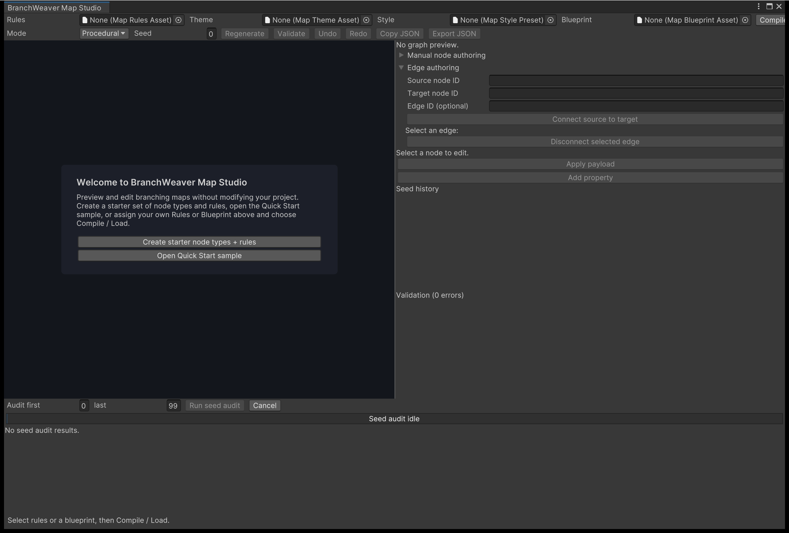

# 2. Generate a map in Map Studio

Map Studio turns a rule set into a graph you can inspect, reproduce from a seed, and test
across hundreds of seeds before a player sees one. Everything here happens in the editor,
from menus and fields. If the package is not imported yet, start with
[1. Install and run the samples](install-and-samples.md).

---

## Create starter node types and rules

Open **Tools > BranchWeaver > Map Studio**. With nothing assigned, the graph area shows a
card offering two ways in: the Quick Start sample, or a starter asset set.

<figure markdown>
  { .shot }
  <figcaption>Map Studio on first open. The toolbar actions stay disabled until something is
  compiled, and the panes down the right &mdash; node and edge authoring, seed history, and
  validation &mdash; fill in as you work.</figcaption>
</figure>

Press **Create starter node types + rules** and choose a folder inside your project's
`Assets` folder. A folder outside `Assets` is refused and nothing is written. Six assets
are created:

| Asset | What it holds |
| --- | --- |
| `Route`, `Rest`, `Landmark`, `Gateway` | One node type each: a stable ID such as `starter.route`, and a display label. No payload. |
| `Starter Rules` | Four layers holding exactly 1, 2, 2 and 1 nodes; type weights Route 6, Rest 2, Landmark 2, Gateway 1; at most two routes out of and into any node; crossing routes forbidden. |
| `Starter Theme` | Vertical layout, curved routes, layer spacing 150, node spacing 110, zoom clamped to 0.65&ndash;2.2. |

The new rules asset is assigned to the **Rules** field, selected in the Project window, and
compiled into a preview immediately. The status line at the bottom of the window names the
folder and the number of assets written.

!!! note "Nothing else in this window writes to your project"
    Creating starter assets, **Apply**, and **Save As** are the only actions that touch an
    asset. Compiling, regenerating, editing and auditing all stay inside the window.

## Compile and regenerate

To preview a rules asset you already own, assign it to **Rules** and press
**Compile / Load**. If the rules cannot compile, the diagnostics pane fills instead and the
status line says so; no preview is produced.

1. Type a number into **Seed**. Decimal and `0x` hexadecimal are both accepted, up to
   4,294,967,295. Anything else is rejected with a status message.
2. Press **Regenerate**. The map changes.
3. Type the *same* number again and regenerate. The identical map returns. This is the
   property everything else on this page rests on.
4. Press **Validate**. The bottom-right pane lists each diagnostic as `code - message`.
   Click one and the nodes it concerns turn amber in the graph.

**Undo** and **Redo** move through preview snapshots, and answer to
++ctrl+z++ / ++ctrl+shift+z++ (++cmd+z++ / ++cmd+shift+z++ on macOS). An asset you have
already applied or saved is not affected by them.

## Understand what you made

### What the rules fix and what varies

A rules asset describes constraints, not a map: how many layers, how wide each layer may
be, which types may appear and how often, how many routes may leave or enter a node. The
generator searches for a graph that satisfies all of it, using the seed as its only source
of variation.

With the starter rules every layer has a fixed width, so every seed produces the same six
nodes. What changes between seeds is which type lands in which slot and which routes are
drawn: each permitted optional route is taken 35 times in a hundred, then dropped if it
would exceed the two-in / two-out limit or cross another route.

When no graph satisfies the rules you get a failure naming the unsatisfiable constraint
rather than a hang or a half-built map. Widening one bound usually resolves it &mdash; see
[Write map rules](../how-to/write-map-rules.md).

### Reading the graph view

Each node is a button labelled with its node type's display label and tinted with that
type's colour, so the type mix is legible without selecting anything. A `[P]` prefix marks
a node whose fields are pinned, `[L]` a locked node. Scroll to zoom, drag with the middle
mouse button to pan, and click a route to select it.

The panel above the diagnostics reports the node and edge count of the current preview, and
lets you edit the selected node. Editing is covered in
[Author a map by hand](../how-to/author-by-hand.md); type colours and labels come from the
node type asset, described in [Create node types](../how-to/create-node-types.md).

## Read the seed history

Under the node details, **Seed history** lists the last 32 generation attempts, newest
first. Each entry shows the seed, `PASS` or `FAIL`, and the graph fingerprint &mdash; the
SHA-256 hash of the generated graph.

- Click an entry to regenerate that seed. The result is prepended to the list, so replaying
  a seed gives you two rows to compare.
- Two rows with the same seed and the same fingerprint mean the map reproduced exactly.
- The same seed with a different fingerprint means the inputs changed underneath it. Which
  changes do that is set out in
  [Determinism, seeds, and fingerprints](../explanation/determinism.md).
- A failed attempt is recorded as `FAIL` but does not replace the preview: the previous
  graph and its seed stay in place, so the window never shows an empty map after a failed
  search.

## Run a seed audit

The strip below the graph audits a whole range at once. Set **Audit first** to 0 and
**last** to 99, then press **Run seed audit**. It generates 100 maps, reports which seeds
failed, and lets you jump to any of them. The range is inclusive and must contain between 1
and 100,000 seeds; a range in Manual mode is refused with
`bw.studio.audit-range-invalid`.

The audit runs off the main thread. The progress bar counts completed seeds and **Cancel**
stops it, keeping the rows already finished and reporting the stop as a warning.

Results appear as two summary lines and one row per seed:

| Line | What it tells you |
| --- | --- |
| Summary | Attempts, successes and failures; node and edge counts as `min..max` across the successful seeds; the mean of each, shown multiplied by 10,000 so it stays an integer &mdash; divide by 10,000 to read it; the largest branch and merge seen. |
| Fingerprint | One hash over every row, so two audit runs can be compared with a string equality check. |
| Seed row | Seed, `PASS` or the failure kind, and that graph's fingerprint. Click the row to preview that seed. |

At most 250 rows are drawn; a wider range keeps the rest in memory and says how many. Any
edit, any regenerate, and any change to the **Rules** or **Blueprint** field clears the
results, so what you are reading always describes the inputs currently loaded.

!!! tip "Audit before you ship a rule set"
    An audit is how you learn that your rules work for seed 7 but are unsatisfiable for
    seed 42 &mdash; before a player rolls seed 42.

## Next

- **[3. Add a map to your scene](add-a-map-to-your-scene.md)** &mdash; turn this preview
  into a running map hierarchy in your own scene.
- **[Write map rules](../how-to/write-map-rules.md)** &mdash; shape, type mix, zones and
  connections, and the diagnostics when a rule set cannot be satisfied.
- **[Determinism, seeds, and fingerprints](../explanation/determinism.md)** &mdash; why the
  same seed reproduces the same graph, and what breaks that.
