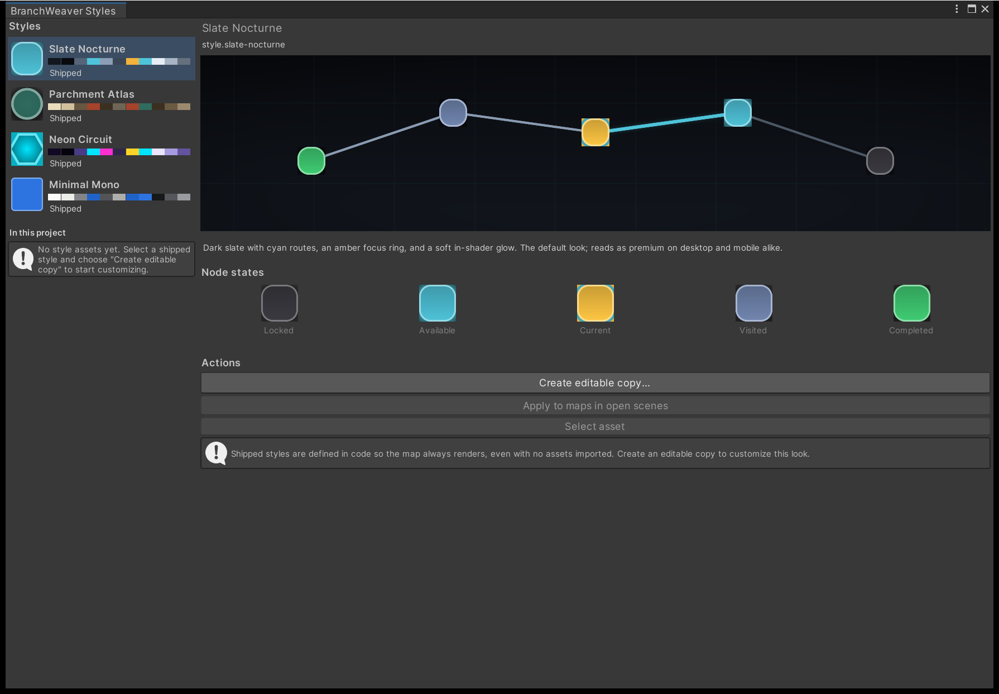
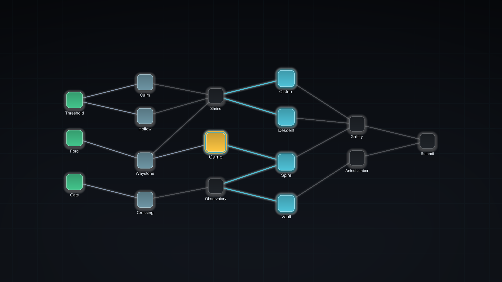
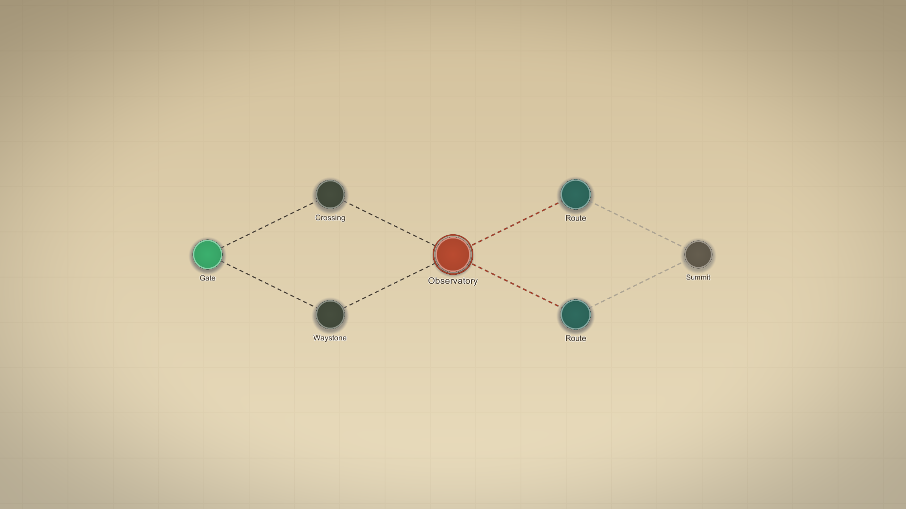
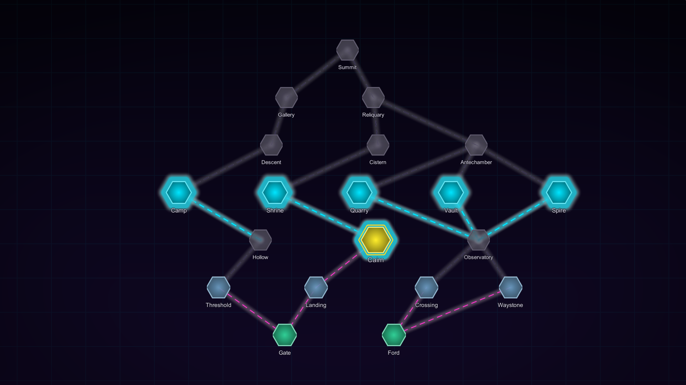
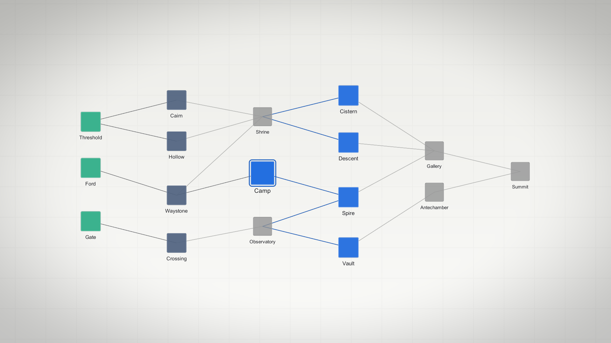

# 5. Restyle your map

Everything the map draws itself with lives in one asset: a **Map Style Preset**. This page
takes the [map you added to your scene](add-a-map-to-your-scene.md) from a shipped look to a
style asset you own, edited with a live preview and applied from the inspector or at runtime.

You do not edit a prefab to restyle the map, because the map has no prefabs. Nodes, routes,
rings, and the backdrop are drawn from the style while the map runs.

## The five-minute loop

<figure markdown>
  { .shot }
  <figcaption>The Style Browser with no style assets in the project yet. The four shipped looks
  list on the left, the preview and the per-state nodes on the right, and
  <strong>Apply to maps in open scenes</strong> stays disabled while a shipped style is
  selected.</figcaption>
</figure>

1. Open **Tools > BranchWeaver > Style Browser**.
2. Pick a style in the left-hand list. The preview is drawn with the shipped shader through
   the shipped token mapping, so it shows what ships. Under it, one node per visual state
   lets you compare emphasis across `Locked`, `Available`, `Current`, `Visited`, and
   `Completed`.
3. Press **Create editable copy...** and choose where to save the asset. It is created with
   the look you were previewing, a display name taken from the file name, and a stable ID
   derived from that name.
4. Select the new asset. Edit its fields; the **Live preview** foldout at the top of the
   inspector redraws as values change.
5. Apply it: assign the asset to the presenter's **Style Preset** field, or press
   **Apply to maps in open scenes** in the browser.

The browser rebuilds its list whenever it regains focus, so an asset you create or rename
shows up under **In this project** without reopening the window.

!!! note "What 'Apply to maps in open scenes' touches"
    It assigns the style to every map presenter in the open scenes, records an undo step per
    presenter, marks them dirty so the change is saved with the scene, and logs how many it
    changed. If no presenter is open it tells you instead of failing quietly. The button is
    disabled while a shipped style is selected, because a shipped style is not an asset that
    a scene can reference.

!!! tip "Starting without a copy"
    **Assets > Create > BranchWeaver > Map Style Preset** also produces a style asset. Its
    fields are seeded from Slate Nocturne, so it opens as a complete look rather than as
    empty colour fields.

## Shipped styles

### The four looks

<div class="grid-2" markdown>

<figure markdown>
  { .shot }
  <figcaption><strong>Slate Nocturne</strong> &mdash; the default. Dark slate, cyan routes, amber focus ring.</figcaption>
</figure>

<figure markdown>
  { .shot }
  <figcaption><strong>Parchment Atlas</strong> &mdash; warm paper, inked circles, dashed routes.</figcaption>
</figure>

<figure markdown>
  { .shot }
  <figcaption><strong>Neon Circuit</strong> &mdash; hex nodes, heavy halos, routes that flow toward reachable nodes.</figcaption>
</figure>

<figure markdown>
  { .shot }
  <figcaption><strong>Minimal Mono</strong> &mdash; light, flat, hairline routes. The neutral base.</figcaption>
</figure>

</div>

### Pick a starting point

| Style | Stable ID | Copy it when |
| --- | --- | --- |
| Slate Nocturne | `style.slate-nocturne` | You want the default: dark surfaces, rounded nodes, soft in-shader glow. |
| Parchment Atlas | `style.parchment-atlas` | The run reads as a journey. Circular nodes, dashed routes, no glow, heavier strokes. |
| Neon Circuit | `style.neon-circuit` | The map should be loud. Hexagons, strong halos, and dashes that animate along reachable routes. |
| Minimal Mono | `style.minimal-mono` | The map must sit inside an existing art direction. Flat fills, hairline routes, no glow. |

A scene that assigns no preset draws with Slate Nocturne.

## Why the styles live in code

The four looks are built in `MapStyleDefaults` rather than shipped as assets. Two
consequences worth knowing:

- A map with no preset assigned still has a complete, valid look, so the package never
  renders as untreated squares and there is nothing to import before it looks right.
- No font, texture, or material is redistributed. Every look is numbers drawn procedurally
  by one shader. Glow is part of that shader rather than post-processing, so turning it up
  cannot conflict with your renderer features or volumes.

A style also cannot change a map. It never enters a graph, a save envelope, or a
fingerprint, so restyling mid-run is safe and a run saved under one style reopens correctly
under another. Which settings belong to the style and which to the theme is covered in
[Style, theme, and the presenter boundary](../explanation/style-and-theme.md).

## Apply a style from code

```csharp
[SerializeField] private MapPresenterBase presenter;
[SerializeField] private MapStylePreset nightStyle;

void EnterNightMode()
{
    presenter.ApplyStyle(nightStyle);   // recompiles and repaints every live view
}
```

`ApplyStyle` replaces the preset, compiles it, and pushes the result to every live node,
edge, and backdrop view. Passing `null` is legal and falls back to the shipped default.

To read resolved values without touching the asset:

```csharp
CompiledMapStyle style = presenter.Style;   // never null
Color accent = style.Palette.Accent;
float nodeSize = style.Node.Size;
```

`MapStyleDefaults.Resolve(preset)` never returns null either, so no call site needs a null
branch. The compiled style is cached, so after editing preset fields while the game runs,
call `ApplyStyle` again to pick them up. `PushStyleToViews()` re-sends the style already
compiled, which is what a view you created yourself needs once it is added.

!!! warning "Canvas views read the style; the world-space views do not"
    `CanvasMapNodeView` and `CanvasMapEdgeView` implement the styled-view contract, so
    palette, shape, glow, and stroke reach them. The default world-space views do not, and
    keep their own sprite treatment. Flow direction still applies to both, because the
    presenter applies it when it converts layout positions for display.

Every field, with its type and range, is listed in
[Styling and appearance](../reference/styling-and-appearance.md).

## Next

- **[Shape and colour nodes](../how-to/style-nodes.md)** &mdash; silhouette, fill, stroke, glow, and which palette role drives which part.
- **[Emphasise node states](../how-to/style-node-states.md)** &mdash; make the node the player can act on the most prominent thing on screen.
- **[Place the map on screen](../how-to/place-the-map-on-screen.md)** &mdash; direction, fit, and space reserved for your own interface.
